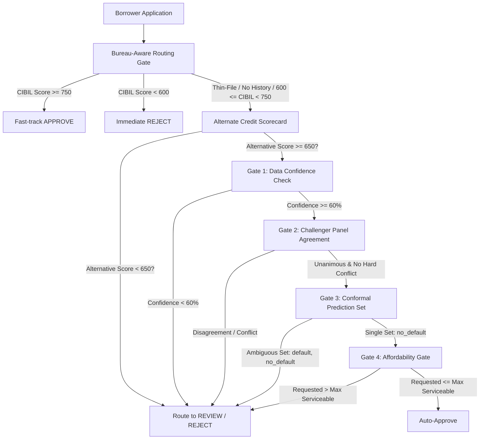

# Alt-Credit Engine

Privacy-preserving alternate credit scoring system for thin-file borrowers in India. Ingests alternative data (telecom, e-commerce, geolocation, cashflow, psychometric survey), encrypts it at rest, extracts ML features, and produces a **300–900 credit score** with EBM-native explainability, adverse-action reason codes, five-facet sub-scores, risk-based lending terms, and portfolio fairness monitoring.

## Architecture

```
AA Consent Gateway → Ingest API → AES-256 Vault → Preprocessing → ml_features + feature_series
                                                                        ↓
                                                    ECM + EBM Champion & Challenger Panel (CatBoost/Logistic)
                                                                        ↓
           Convergence (PDO scorecard + facets + Native Explanations + Conformal Abstention + lending) → Audit Trail
                                                                        ↓
                                                    Bank Dashboard (portfolio, model card, fairness)
```

## Key Improvements (Hackathon-Ready)

| Feature | Description |
|---------|-------------|
| **Generative ground truth** | Latent creditworthiness → Bernoulli default; model learns from noisy features, not circular rules |
| **Real econometrics** | ADF/ECM on actual monthly cashflow / telecom payment series |
| **PDO scorecard** | Log-odds to points (base 600, PDO 50, range 300–900) |
| **Model Panel & Conformal Abstention** | Glass-box EBM (Explainable Boosting Machine) champion model is audited by a panel of challengers (CatBoost + Logistic). Split conformal prediction provides statistical guarantees; disagreements/abstentions route to human review rather than silent auto-lending. |
| **Model card** | Holdout AUC, Gini, KS, calibration, CV metrics for the ensemble models at `/score/model/card` |
| **Reason codes** | Plain-language adverse action reasons derived directly from EBM native additive terms |
| **Fairness report** | Disparate impact ratio across protected groups |
| **Granular Consent & DPDP rights** | Account Aggregator-style consent with purpose, expiry, scope tracking, and partial revocation; borrower can revoke specific scopes (by consent ID or user ID) or request full data erasure (DPDP Act 2023 §6/§12); raw PII and ML features deleted on erasure, anonymised `score_decisions` retained 5 years per RBI audit rules; bureau-caveat disclosed at consent time |
| **Borrower privacy dashboard** | Once signed in, borrowers visit `/consent?user_id=<id>` to see live consent status (ACTIVE/REVOKED), data presence (PRESENT/DELETED), tracked scopes, and take action |
| **Borrower accounts (mandatory login)** | Every borrower page (`/apply`, `/consent`, `/assessment`, `/borrower`) requires sign-in at `/login`; passwords are PBKDF2-hashed with a per-account salt, login issues a revocable bearer token, and `/score/me` resolves the caller from that token, so an assessment is bound to an account, not a shareable link |
| **Role-based access control** | Borrowers see only their own assessment; bank officers (with API key) see full portfolio, all scores, and admin endpoints; portfolio endpoints forbidden without authentication |
| **Five-facet sub-scores** | Per-data-source scores (telecom, spending, location, cashflow, psychometric), 0–100, population-normalised, drives the radar chart |
| **Coherent explainability** | EBM's native additive terms are exact (`base_points + Σ feature_points == credit_score`), avoiding post-hoc approximations (like SHAP) and enabling a globally stable points table |
| **Risk-based lending** | Recommends max loan, risk-priced rate, tenure, and EMI per applicant |
| **Confidence / thin-file** | Data-sufficiency score from how many facets are backed by real data; low-confidence files routed to review, never silent auto-approve |
| **Audit trail** | Every decision logged to `score_decisions` table |
| **Self-seeding startup** | Demo cohort auto-loads into the DB on first boot (idempotent), no manual seed/load/train; SQLite mode is the primary path for live demos |
| **Deployment** | Local SQLite run for demos today; Docker + docker-compose (Postgres) is the intended production path, currently broken, fix planned before the finale |
| **Multilingual psychometrics** | Agent-guided assessment in EN/HI/BN with deterministic trait scoring; language is chosen once (at login/consent) and carried through the whole flow (the in-chat language picker stays hidden on `/assessment` so it can't be changed mid-session; Likert questions use tap-to-select buttons (text input hidden); open-ended questions show a text input box, an on-screen Hindi/Bengali keyboard toggle (Devanagari/Bengali layouts with matras, translated Space/Backspace/Clear, so typing native script never depends on the device having an Indic system keyboard installed), *and a mic button* for voice answers (Sarvam STT primary, Gemini fallback, browser Web Speech API default); transcribed text lands in the input box for borrower review/edit before submit; agent prompts can be **read aloud in real Hindi/Bengali voices** (Sarvam `bulbul` TTS) via a live "AI voice" toggle) closing the gap where most devices have no `hi-IN`/`bn-IN` system voice and stay silent; toggling off reverts to the browser's built-in speech synthesis; animated processing screen shown while scoring runs. Enforces time limits with partial submission handling. |
| **Borrower onboarding** | Pre-consent intent capture: borrower selects category (Salaried, Vendor, Farmer, Student, etc.), purpose (linked to category), and requested loan amount, all in EN/HI/BN; free-text fields (business description, "Other" purpose) carry the same on-screen Hindi/Bengali keyboard as the assessment page. Moves category selection off the portal page to a dedicated onboarding flow. |
| **LLM business profiler** | MSME borrowers (Vendor/Farmer) describe their business in free text (any language, typed via the on-screen Indic keyboard or a system keyboard); Groq LLM extracts sector, vintage, turnover, seasonality, employees with confidence routing; deterministic multilingual fallback (lakh/hazaar numerals, keyword sector maps) when unsure or offline; borrower confirms every field before submit; raw description encrypted to vault. |
| **Affordability gate** | Post-decision lending-policy overlay: if model APPROVEs but requested amount exceeds max serviceable amount, outcome is REVIEW with an explicit counter-offer message (not a silent "approved as requested"). Model decision, PD, score, and fairness parity untouched, only borrower-facing outcome changes. |
| **Self-report honesty check** | Two new model features added via onboarding: `business_vintage_years` (0 for individuals) and `turnover_income_consistency` (declared vs observed monthly income ratio, clipped [0,1]). Inflating turnover strictly hurts the applicant (anti-gameable); consistency scores, not the claim itself. |
| **Cohort-aware imputation** | A missing/consent-revoked data source is filled with the borrower's *own cohort* median (typical-applicant), not a biased `0.0`; structurally-N/A features (e.g. business vintage for a salaried worker) correctly stay `0.0`. Learned at training time (`models_ai/imputation.py`, `artifacts/imputation_stats.json`); committed scores unchanged. |
| **Auto-drafted decision letter + officer sign-off** | Rejections/reviews are drafted as a deterministic, tri-lingual (EN/HI/BN) regulator-format adverse-action notice from the model's own reason codes; a loan officer reviews and signs (identity + timestamp stamped) via the dashboard review queue, then the borrower retrieves the signed letter in-app. Approvals auto-issue. Endpoints under `/letters`. |

## Prerequisites

- Python 3.11+
- Groq API key (optional; survey NLP falls back to keyword heuristics)

## Quick Start (zero-dependency local laptop demo — this is how we demo)

For a quick offline run with **no Docker and no Postgres**, set `USE_SQLITE=true`. The engine uses a local SQLite file and self-seeds on first boot:

```bash
python -m venv .venv && source .venv/bin/activate
pip install -r requirements.txt
USE_SQLITE=true uvicorn api.main:app --port 8000
```

Open http://localhost:8000/dashboard, populated automatically.

Seeding is idempotent (it skips if the database already has data), so restarts are safe. Training stays an explicit action (`POST /score/train` or `python -m models_ai.train`) so you can demo the full ECM + EBM ensemble pipeline live. `SEED_ON_STARTUP` defaults to `true`; set it to `false` if you want an empty database on boot.

## Docker + Postgres (production-shaped configuration — currently broken, fix planned)

This is the configuration meant for managed Postgres hosts (e.g. Render): same self-seeding behaviour, but against Postgres instead of SQLite. It's currently not working locally; SQLite is the path actually used for demos until this is fixed.

```bash
cp .env.example .env
docker compose up --build
```

Postgres remains the intended production/deployed backend once fixed (a provided `DATABASE_URL`, e.g. on Render, always takes precedence over `USE_SQLITE`).

## Demo UI

| URL | Description |
|-----|-------------|
| http://localhost:8000/ | Welcome page: choose bank dashboard or borrower portal |
| http://localhost:8000/login | **Borrower sign-in / account creation** (required before any borrower page; redirects back to `?next=` on success |
| http://localhost:8000/apply | **Borrower portal** (requires sign-in): start a new application or view previous results (stored in browser, scoped to the signed-in account) |
| http://localhost:8000/onboard | **Borrower onboarding**: select category, loan purpose (category-linked), requested amount; Vendor/Farmer describe business for LLM extraction; borrower confirms fields; then proceeds to consent |
| http://localhost:8000/consent | RBI AA consent gateway (requires sign-in; granular scope selection + disclosure) |
| http://localhost:8000/consent?user_id=`<id>` | Borrower privacy dashboard: check granular consent & data status, revoke specific scopes, or request data erasure |
| http://localhost:8000/assessment | Multilingual agentic psychometric chat (requires sign-in; EN/HI/BN); redirects to result page when done |
| http://localhost:8000/borrower | Borrower-only result page (requires sign-in); resolves the signed-in account's latest score, or a specific `?session=<session_id>` right after finishing an assessment; shows score, PD, decision, EBM native drivers, and adverse-action reason codes |
| http://localhost:8000/dashboard | Bank LOS dashboard with portfolio model panel (EBM/CatBoost/Logistic), interactive EBM shape-function viewer, facets radar, model card, fairness, and lending terms (API key required) |
| http://localhost:8000/docs | FastAPI Swagger UI |
| http://localhost:8000/consent/compliance | Regulatory compliance summary |

**Psychometric constructs measured:** conscientiousness, locus of control, financial self-efficacy, present bias, debt attitude. The agent handles conversation; a fixed rubric produces the score.

## API Endpoints

| Method | Path | Auth | Description |
|--------|------|------|-------------|
| GET | `/health` | - | Health check + model version |
| POST | `/auth/register` | - | Create a borrower account (`login_id` + `password`); returns a bearer token |
| POST | `/auth/login` | - | Authenticate a borrower account; returns a bearer token |
| POST | `/auth/logout` | Bearer | Revoke the caller's bearer token |
| GET | `/auth/me` | Bearer | Return the authenticated borrower's `user_id` / `login_id` |
| GET | `/consent/authorize?user_id=` | - | RBI AA consent authorization; optional `user_id` links the consent artifact to the borrower for status lookups |
| POST | `/consent/token` | - | AA token exchange |
| POST | `/consent/revoke` | - | Revoke consent / scopes; accepts `consent_id`, `user_id`, or specific `scopes` to revoke |
| POST | `/consent/erasure` | - | DPDP right to erasure: deletes `secure_vault`, `ml_features`, `feature_series` for the user; retains anonymised `score_decisions` |
| GET | `/consent/status/{user_id}` | - | Returns granular consent status (active/revoked/unknown per scope), data presence, and erasure state for the borrower privacy dashboard |
| GET | `/consent/compliance` | - | Regulatory compliance summary including borrower rights and bureau caveat |
| POST | `/ingest/{data_type}` | - | Ingest encrypted payload (`telecom`, `ecommerce`, `geo`, `cashflow`, `survey`) |
| POST | `/ingest/ground_truth` | API Key | Store generative labels (training only) |
| POST | `/intake/submit` | Session | Submit borrower intent + business profile; validates purpose-cohort match; encrypts raw description to vault; inserts latest-wins `ApplicationIntake` |
| POST | `/intake/business-profile` | Session | Extract structured business fields from free-text description (LLM with fallback) |
| GET | `/intake/{user_id}` | Session | Retrieve latest application intake for user |
| GET | `/intake/purposes` | - | List allowed loan purposes and business cohorts (categories) |
| GET | `/score/me` | Bearer or Session | Authenticated borrower's own score, prefers the account bearer token, falls back to the ephemeral `X-Session-Id` used right after finishing an assessment |
| GET | `/score/{user_id}` | Session or API Key | Credit score for user_id; borrower can only access their own via their session, bank officers use API key |
| GET | `/score/` | API Key | All user scores (bank only) |
| GET | `/score/portfolio/summary` | API Key | Portfolio + fairness metrics (bank only) |
| GET | `/score/model/card` | - | Model validation metrics across EBM champion and challengers |
| GET | `/score/model/explanations` | - | EBM global shape functions (bin edges + per-bin points) for interactive curves |
| POST | `/score/train` | API Key | Train ECM + EBM Champion + challengers (CatBoost, Logistic) and fit conformal calibration |
| GET | `/letters/me` | Session | Authenticated borrower's own decision letter, rendered in `?lang=en\|hi\|bn`; `available:false` while awaiting officer sign-off |
| GET | `/letters/pending` | API Key | Officer review queue, rejection/review letters awaiting sign-off |
| GET | `/letters/{user_id}` | API Key | Officer view of a borrower's drafted/issued letter (`?lang=`) |
| POST | `/letters/{user_id}/sign` | API Key | Officer sign-off, stamps officer ID + timestamp and issues the letter to the borrower |
| GET | `/assessment` | - | Multilingual psychometric UI |
| POST | `/assessment/start` | - | Start agentic assessment session |
| POST | `/assessment/answer` | - | Submit answer to current item (tracks time elapsed and enforces limits) |
| GET | `/assessment/session/{session_id}` | - | Session progress and trait snapshot |
| GET | `/speech/config` | - | Report which server-side voice features are available (`stt_available`, `tts_available`); client falls back to the browser's Web Speech API / speech synthesis when false |
| POST | `/speech/transcribe` | - | Transcribe audio from mic (multipart; audio file + language code); returns text transcript |
| POST | `/speech/synthesize` | - | Synthesize agent prompt text to speech (JSON: text + language); returns WAV audio (Sarvam `bulbul` Indian-language voices) |
| POST | `/api/verify-live-location` | - | Compare live GPS check-in to e-commerce delivery pin history |

## Authentication & Access Control

**Borrower (account login, mandatory):**
- Every borrower page (`/apply`, `/consent`, `/assessment`, `/borrower`) redirects to `/login?next=<page>` if the caller has no valid bearer token
- `POST /auth/register` / `POST /auth/login` create or authenticate an account (`login_id` + `password`, PBKDF2-hashed with a per-account salt) and return a bearer token; the browser stores it and sends `Authorization: Bearer <token>` on subsequent requests
- The account's `user_id` is stable across devices/sessions, so `GET /score/me` (with the bearer token) returns the same assessment no matter where the borrower signs in
- Right after finishing an assessment (before the redirect), the ephemeral in-memory `X-Session-Id` header is used as a fallback credential for `GET /score/me`. This is the same mechanism the old session-only model used, now secondary to the account token
- Previous applications are listed in browser localStorage, scoped to the signed-in account (filtered out if a different account is signed in on the same browser)

**Bank Officer (API key):**
- Requires `API_KEY` env var (set in `.env`)
- Send as `X-API-Key` header to access:
  - `GET /score/`, all borrower scores
  - `GET /score/portfolio/summary`, portfolio overview, model panel agreement, fairness metrics
  - `GET /score/{user_id}`, any borrower's full details (with panel and EBM native drivers)
  - `POST /score/train`, trigger ensemble model training
  - `POST /ingest/ground_truth`, add training labels

**What borrowers cannot see:**
- Portfolio overview (approval rates, average scores, fairness metrics)
- Other borrowers' names, scores, or data
- Admin endpoints (training, ground truth)

**What bank officers can see:**
- Entire portfolio with aggregated stats and EBM global curves
- Individual borrower scores, model panel consensus, and conformal prediction bounds
- Model card and validation metrics
- Fairness monitoring dashboard

## Environment Variables

| Variable | Default | Purpose |
|----------|---------|---------|
| `SEED_ON_STARTUP` | `true` | Auto-seed demo cohort into an empty DB on boot |
| `USE_SQLITE` | `false` | Use local SQLite instead of Postgres |
| `DATABASE_URL` | - | Managed Postgres URL (overrides `USE_SQLITE` and `POSTGRES_*`) |
| `API_KEY` | - | 32+ char alphanumeric string; protects bank endpoints (`/score/`, `/score/portfolio/summary`, `/score/train`, `/ingest/ground_truth`). If empty, these endpoints are publicly accessible (demo only). |
| `AES_SECRET_KEY` | dev default | 64-char hex key for AES-256-GCM vault encryption |
| `GROQ_API_KEY` | - | Optional LLM for psychometric agent (heuristic fallback); uses `llama-3.1-8b-instant` by default |
| `SPEECH_STT_PROVIDER` | `none` | Server-side speech-to-text: `sarvam` (primary, Indian-language tuned), `gemini` (fallback), or `none` (browser Web Speech API only) |
| `SARVAM_API_KEY` | - | Sarvam AI key; powers STT when `SPEECH_STT_PROVIDER=sarvam`, and also enables the assessment's "AI voice" (server TTS) toggle whenever set |
| `GEMINI_API_KEY` | - | Google Gemini API key; required if `SPEECH_STT_PROVIDER=gemini` |

See `.env.example` for the full list.

## Fairness Monitoring: the 80% Rule (Disparate Impact)

The engine never feeds protected attributes (caste/community group) into the model; they are used **only after scoring** to audit fairness. Every portfolio is checked with the **80% rule** (a.k.a. *disparate impact* / *adverse impact ratio*), a standard fair-lending test:

1. Compute the **approval rate for each protected group** (general, OBC, SC, ST, minority).
2. Take the ratio **lowest group's rate ÷ highest group's rate** → the **disparate impact ratio**.
3. If that ratio is **below 0.80**, the model may be disadvantaging a group → it is **flagged for manual review** rather than acted on automatically.

Example: a ratio of `0.44` means the least-approved group is approved at only 44% of the most-approved group's rate (below 0.80, so it is flagged. On the synthetic demo cohort this is mostly small-sample noise (protected group is assigned independently of creditworthiness, ~20 borrowers per group), **not** real bias) but it demonstrates the safeguard actually detecting and surfacing disparity, exactly as a real deployment would. The dashboard shows the ratio, per-group approval rates, and a pass/flag verdict at `/score/portfolio/summary` and on the **Fairness Monitor** chart.

Implemented in [`convergence/fairness.py`](convergence/fairness.py); threshold `DISPARATE_IMPACT_THRESHOLD = 0.8`.

## Bureau-Aware Routing & Operational Safety Gates

To ensure institutional compliance and reliability, the system evaluates applications through a sequential process: first checking traditional bureau history, and fallback to the alternative credit scorecard which is guarded by a multi-layered safety net of **4 Operational Gates**.



### Bureau-Aware Routing (Pre-Screening Gate)
* **Goal:** Intelligently screens applicants to fast-track traditional prime credit holders, auto-reject subprime files, and route thin-file/no-history borrowers to the alternative scoring engine.
* **Condition:** Checks traditional bureau credit score if available (CIBIL score $\neq -1$ and not null).
  * `cibil_score >= 750`: Fast-track auto-approval (`APPROVE`) at 11% p.a. interest over 36 months, bypassing alternative scoring.
  * `cibil_score < 600`: Immediate rejection (`REJECT`), bypassing alternative scoring.
  * Missing CIBIL score (`-1` or null) or thin/borderline file (`600 <= cibil_score < 750`): Fallback to full alternative credit scoring pipeline.
* **Implementation:**
  * [`convergence/score_engine.py::score_user`](file:///Users/sonil/Desktop/alt-credit-engine/convergence/score_engine.py#L454) queries the `BorrowerAccount` record for CIBIL history and applies these routing logic before initializing feature extraction or model runs.

### The 4 Operational Safety Gates

#### 1. Data-Sufficiency / Thin-File Check (Gate 1)
* **Goal:** Abstains from auto-approving borrowers who submit extremely sparse alternative data payloads.
* **Condition:** `confidence_pct < 60.0` (defined as `LOW_CONFIDENCE_PCT` in [`convergence/score_engine.py`](file:///Users/sonil/Desktop/alt-credit-engine/convergence/score_engine.py)).
* **Implementation:**
  * [`convergence/facets.py::compute_confidence`](file:///Users/sonil/Desktop/alt-credit-engine/convergence/facets.py#L342) scans the active alternative data facets (telecom, e-commerce, cash flow, psychometrics) for non-null values.
  * It divides `features_with_data` by `denominator` (the total expected features for that specific cohort).
  * If this ratio falls below 60.0%, the decision returned by `_decision_from_score` is automatically forced from `APPROVE` to `REVIEW`.

#### 2. Challenger Ensemble Agreement Check (Gate 2)
* **Goal:** Abstain if the primary model's decision is contested by challenger models from different families.
* **Condition:** Either a "hard conflict" exists, or an `APPROVE` call lacks panel unanimity.
* **Implementation:**
  * [`convergence/score_engine.py::compute_agreement`](file:///Users/sonil/Desktop/alt-credit-engine/convergence/score_engine.py#L327) compares the output of the EBM champion with CatBoost and Logistic Regression challengers.
  * A **Hard Conflict** occurs if one model predicts `APPROVE` while another predicts `REJECT`.
  * Non-unanimous approval occurs if the EBM champion predicts `APPROVE`, but the CatBoost or Logistic Regression models suggest `REVIEW` or `REJECT`.
  * Both conditions override an auto-decision and route the case to `REVIEW`.

#### 3. Conformal Prediction Set Check (Gate 3)
* **Goal:** Abstain if the model's calculated Probability of Default ($PD^*$) falls in a region of high statistical uncertainty.
* **Condition:** $1 - q \le PD^* \le q$ (where $q$ is the nonconformity quantile threshold learned on a held-out calibration set at a 90% confidence level, $\alpha = 0.10$).
* **Implementation:**
  * In [`models_ai/conformal.py`](file:///Users/sonil/Desktop/alt-credit-engine/models_ai/conformal.py), we calculate nonconformity scores on a calibration dataset: $S_i = 1 - p(y_i \mid x_i)$.
  * We extract the threshold $q$ as the $(1 - \alpha)$-quantile of these scores (typically capped at $0.98$ to prevent extreme noise from blocking all loans).
  * At scoring time, if $PD^*$ satisfies both $PD^*$ $\le q$ (include `no_default` in prediction set) and $PD^*$ $\ge 1-q$ (include `default` in prediction set), the set contains both labels.
  * [`apply_conformal_gate`](file:///Users/sonil/Desktop/alt-credit-engine/models_ai/conformal.py#L103) changes the outcome to `REVIEW` if `abstain` is True and the tentative decision was `APPROVE`.

#### 4. Affordability Gate Check (Gate 4)
* **Goal:** Post-decision lending-policy overlay that prevents auto-approving a loan value that exceeds the borrower's serviceable limit.
* **Condition:** Requested loan amount > Max Serviceable Amount.
* **Implementation:**
  * In [`convergence/lending.py::evaluate_funding_gap`](file:///Users/sonil/Desktop/alt-credit-engine/convergence/lending.py#L141), we calculate the borrower's maximum serviceable loan principal based on their FOIR (Fixed Obligation to Income Ratio) and assessed monthly income.
  * If the model approves the risk profile but the requested amount is higher than the max serviceable principal, `evaluate_funding_gap` returns `gated: True`, which changes `final_outcome` to `REVIEW` with an explicit counter-offer recommendation.


### Model Performance Metrics (from `/score/model/card`)

The models are trained on identical splits of the target database to ensure fair performance comparison:

| Metric / Model | Champion (EBM) | Challenger (CatBoost) | Challenger (Logistic Regression) |
| :--- | :--- | :--- | :--- |
| **Holdout AUC** | `0.6667` | `0.7500` | `0.3333` |
| **Gini Coefficient** | `0.3333` | - | - |
| **Kolmogorov-Smirnov (KS)** | `0.6111` | - | - |
| **Holdout Accuracy** | `90.00%` | - | - |
| **CV AUC (5-fold Mean ± Std)** | `0.7681 ± 0.1903` | - | - |

- **Conformal Calibration**: Target coverage is set to `90.0%` ($\alpha = 0.10$). Current empirical coverage is `93.75%` on the held-out calibration split ($N = 16$).
- **Scorecard Anchoring**: The 300–900 scorecard is calibrated with a base score of 600 at base odds of 10:1 (corresponding to the population's real default rate of ~13%).
- **Decision Cutoffs**:
  - **APPROVE**: Score $\ge 650$ (EBM Probability of Default $\le 4.76\%$)
  - **REVIEW**: Score $\ge 560$ (EBM Probability of Default $\le 14.83\%$)
  - **REJECT**: Score $< 560$

### Model Feature Schema (42 Input Variables)

The ensemble models process 42 features across five alternative data facets, onboarding intake fields, and cohort-specific transaction profiles. The features, grouped by their AA-style consent scope, are:

| Consent Scope | Feature Name | Description |
| :--- | :--- | :--- |
| **Telecom** | `avg_days_late` | Average days late on bill payments or prepaid recharge delay |
| | `missed_payments_count` | Number of missed billing cycles or inactive SIM periods (includes SIM vintage penalty) |
| | `sms_bill_delay` | SMS-parsed bill payment delay (average days late from alert to confirmation; 0.0 if scope revoked) |
| **E-Commerce** | `necessity_ratio` | Ratio of essential/necessity purchases to total spend |
| | `avg_merchant_rating` | Average rating of merchants visited |
| | `monthly_spend_volatility` | Volatility in e-commerce spend patterns |
| | `sms_spend_total` | Total monthly transaction spend parsed from SMS notifications (0.0 if scope revoked) |
| **Geolocation** | `spatial_variance_score` | Delivery address drift entropy calculated from e-commerce shipping records |
| | `anchor_count` | Number of unique delivery PIN codes |
| **Cashflow** (Econometric) | `monthly_income_mean` | Estimated mean monthly cash inflows |
| | `monthly_expense_mean` | Estimated mean monthly cash outflows |
| | `cashflow_volatility` | Volatility of monthly cash flow |
| | `cash_burn_rate` | Post-payday cash depletion velocity (ratio of debits in the first 7 days post-payday) |
| | `resilience_coefficient` | Co-integration coefficient estimated via single-equation Error Correction Model (ECM) |
| | `adf_statistic` | Augmented Dickey-Fuller stationarity test statistic (runs on detrended net cashflow series) |
| | `adf_pvalue` | P-value of the ADF stationarity test |
| | `is_stationary` | Binary indicator (1.0 if `adf_pvalue` < 0.05) indicating stable mean cashflow |
| | `trend_slope` | Slope of the linear trend line fitted to the net cashflow series |
| | `upi_lite_txn_count` | Count of UPI Lite pocket-wallet transactions (parsed from bank statement narration; 0.0 if scope revoked) |
| | `upi_lite_average_ticket` | Average ticket size of UPI Lite transactions (0.0 if scope revoked) |
| | `dbt_income_consistency` | Consistency of Direct Benefit Transfer (DBT) welfare receipts (0.0 if scope revoked) |
| **Psychometric** | `conscientiousness` | Psychometric score measuring diligence and organization (0–100) |
| | `locus_of_control` | Score measuring internal vs. external attribution of life events (0–100) |
| | `financial_self_efficacy` | Score measuring confidence in managing financial goals (0–100) |
| | `present_bias` | Score measuring immediate reward orientation vs. long-term planning (0–100) |
| | `debt_attitude` | Score measuring risk aversion/comfort with debt (0–100) |
| | `response_validity` | Metric measuring psychometric response integrity (survey-time patterns, consistency) |
| **Onboarding** (Borrower-declared) | `business_vintage_years` | Stated years in operation for micro-enterprise (GigWorker/Farmer/Vendor; 0.0 for others) |
| | `turnover_income_consistency` | Self-report honesty check: ratio of declared turnover to observed bank cash inflow (clipped `[0.0, 1.0]`) |
| **Campus** (Student) | `upi_spend_consistency` | Ratio/consistency of student UPI spend patterns (0.0 for non-students) |
| | `small_dues_payment_promptness` | Promptness in clearing small dues and utility bills (0.0 for non-students) |
| | `e_wallet_topup_frequency` | Frequency of e-wallet top-ups (indicating active payment channels; 0.0 for non-students) |
| **Vendor** | `daily_transaction_count` | Average daily transaction count for micro-business operations (0.0 for non-vendors) |
| | `average_ticket_size` | Average transaction ticket size (0.0 for non-vendors) |
| **Farmer** | `harvest_income_spike` | Peak income spikes matching harvest season cycles (0.0 for non-farmers) |
| | `input_purchase_consistency` | Consistency in purchasing seed, fertilizer, and agricultural inputs (0.0 for non-farmers) |
| | `enam_receipt_volume` | Verified Mandi sale transaction volumes from e-NAM platform (0.0 for non-farmers/scope revoked) |
| **Household** (Homemaker) | `utility_payment_consistency` | Consistency of home utility bill payments (electricity, gas, water; 0.0 for non-homemakers) |
| | `grocery_spend_stability` | Stability of monthly grocery spend volatility (0.0 for non-homemakers) |

### Econometric Resilience Modeling (ECM)
The cashflow facet uses a single-equation Error Correction Model to capture financial recovery speed. On the monthly net cashflow series, the system fits:
$$\Delta y_t = \alpha + \gamma (y_{t-1} - \bar{y}) + \epsilon_t$$
The **resilience coefficient** is derived as $\max(0, \min(1, -\gamma))$, indicating how quickly a borrower's account returns to equilibrium after an income shock. If Augmented Dickey-Fuller (ADF) confirms the net cashflow series is stationary ($\text{p-value} < 0.05$), the coefficient is given a $+0.1$ booster.

### Cohort-Aware Imputation
To prevent bias against thin-file applicants, missing features or those masked by revoked consent scopes are imputed with the median of the borrower's **own cohort** (e.g. Salaried, Vendor, Farmer, GigWorker) rather than a penalizing `0.0`. Features that are structurally inapplicable to a cohort (e.g., `business_vintage_years` for Salaried) remain `0.0`, ensuring fair and context-appropriate scoring.

### Typical-Applicant-Centered Explanations
Explainable Boosting Machine (EBM) feature contributions (pre-calculated per-feature points) are re-centered against the population-average contribution (the typical applicant) instead of the raw intercept.
- **Why**: Since EBM is trained with balanced class weights, its intercept sits near a 50% coin-flip probability of default, making low-risk applicants look positive on every feature (causing an all-positive explainability report).
- **Solution**: Centering on the typical applicant means features only add points if they outperform their cohort peer, and subtract points if they fall short. This reduces all-positive report cards from ~50% of applicants to an honest ~14%, highlighting both strengths and areas needing improvement without changing the underlying probability of default, score, or decision.

## Deployment

The intended production target is **Render** (Web Service + managed Postgres), via the Docker + docker-compose path above; this is currently broken and not what we're demoing (see Quick Start). Once fixed, deploy in the Render dashboard:

1. Connect this GitHub repo and set **Dockerfile** as the build method
2. Add a Postgres instance and set `DATABASE_URL` on the web service
3. Copy remaining env vars from `.env.example` (`API_KEY`, `AES_SECRET_KEY`, etc.)
4. Set start command to `bash scripts/entrypoint.sh` and health check path to `/health`

Set `SEED_ON_STARTUP=true` (the default) so the demo dashboard is populated on first boot. The legacy `AUTO_SEED_ON_STARTUP` flag in `scripts/entrypoint.sh` triggers an alternate full generate → API load → train path and is not needed when using the bundled model artifacts.

Other options for local pitches or production narratives:

| Platform | Best For | Tradeoff |
|----------|----------|----------|
| **Render** (deployed) | Hosted demo URL | Cold starts on free tier |
| **docker-compose on Mumbai VM** | Data localization story | You manage ops |
| **ngrok** | Live pitch from laptop | Ephemeral URL |

## Testing Borrower vs Bank Flows

**Borrower flow:**
1. Open http://localhost:8000/apply, redirected to `/login` since you're signed out
2. Create an account (login ID + password) or sign in → redirected back to `/apply`
3. Click "Start New Application" → goes to `/consent`
4. Complete granular consent flow → redirects to `/assessment`
5. Answer assessment questions → auto-redirects to `/borrower?session=<sessionId>`
6. View your score (only your own data visible; driven by EBM native points)
7. Click "Home" → returns to `/apply`, previous result now listed
8. Sign out, then sign back in on a different browser/device → `/borrower` still resolves your latest score via the account, not the URL

**Bank flow:**
1. Set `API_KEY=test-key-123` in `.env`
2. Restart server
3. Open http://localhost:8000/dashboard
4. Add `X-API-Key: test-key-123` header (browser dev tools or use curl/Postman)
5. View portfolio overview, all borrowers, model panel agreement, and EBM curves
6. Search for a borrower by ID to see their full details and panel consensus

**Access control test:**
```bash
# Register (or log in) to get a bearer token
curl -X POST -H "Content-Type: application/json" \
  -d '{"login_id":"ravi_kumar","password":"secret123"}' \
  http://localhost:8000/auth/register
# {"token": "...", "user_id": "...", "login_id": "ravi_kumar"}

# Borrower can only see their own score
curl -H "Authorization: Bearer <token>" http://localhost:8000/score/me

# Borrower cannot access another borrower's score
curl -H "X-Session-Id: <their-session-id>" http://localhost:8000/score/<other-user-id>
# Response: 403 Forbidden

# Bank officer can see all scores
curl -H "X-API-Key: test-key-123" http://localhost:8000/score/

# Without API key, portfolio endpoints are blocked
curl http://localhost:8000/score/portfolio/summary
# Response: 401 Unauthorized
```

## Testing

```bash
pytest tests/ -v
```

## License

Hackathon prototype, not for production use without regulatory approval.
