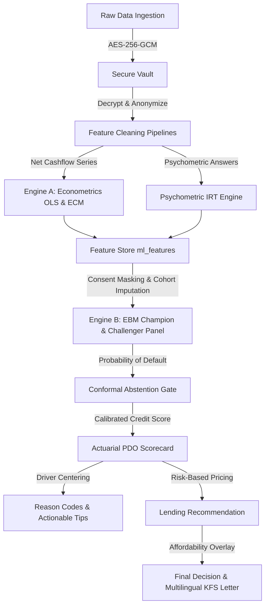
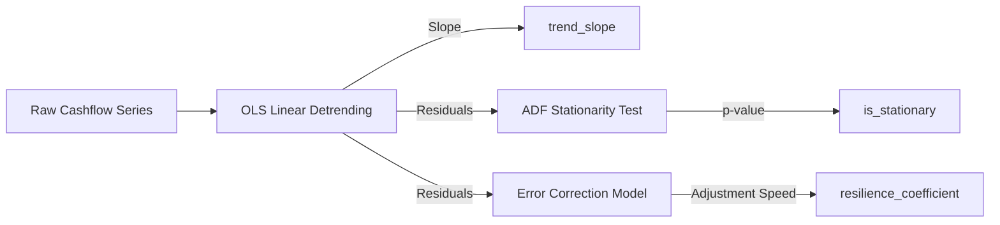
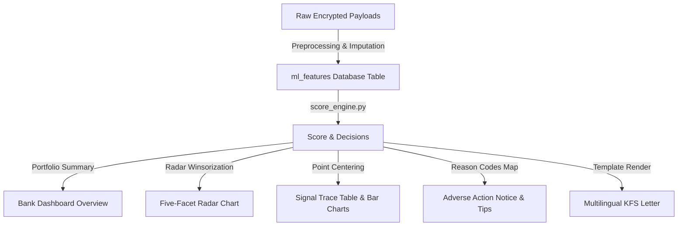

# Alternate Credit Engine: Comprehensive A-to-Z Model Reference Guide

This document provides a complete, line-by-line, file-by-file breakdown of the alternate credit scoring engine. It is designed to serve as an exhaustive reference for both technical stakeholders (auditors, risk engineers) and non-technical reviewers (policy makers, business leaders).

---

## High-Level Architecture Overview

The system uses alternative data sources (telecom, e-commerce, geolocation, bank cash flow, and psychometrics) to evaluate the creditworthiness of borrowers who lack traditional bureau credit files (thin-file borrowers). 

The process is structured in a two-stage sequential pipeline:
1. **Engine A (Econometric & Statistical Cleaning):** Takes raw, volatile time series and outputs stable, detrended indicators of growth and resilience.
2. **Engine B (AI Champion/Challenger Panel):** Takes the processed features and passes them to a glass-box Explainable Boosting Machine (EBM) model to calculate default probabilities, audited by a panel of CatBoost and Logistic Regression models.

The final risk profile is calibrated into a traditional **300–900 credit score** with exact points reconciliation, regulatory-compliant Key Fact Statement (KFS) reason codes, and risk-based loan pricing terms.

---

## Section 1: Value Proposition & Defensibility (The Hackathon Win Conditions)

To win over credit-risk officers, regulators, and data protection authorities, the platform integrates 8 core engineering decisions, positioned as answers to critical judge concerns:

### 1. The Intrinsically Explainable Champion (Glass-Box EBM vs. Black-Box + SHAP)
* **Judge Concern:** *"Post-hoc explanation tools like SHAP or LIME only guess at what a black-box model (like CatBoost) did. The actual decider remains opaque. How can regulators or risk officers audit the actual model?"*
* **Our Solution:** We replaced the black-box champion with an **Explainable Boosting Machine (EBM)**. EBM is a generalized additive model (GAM) trained with boosting. Because it uses zero-interaction terms, its decision curves *are* the model itself. There is no post-hoc approximation: a risk officer can read risk weights directly off the shape curves and manually edit them if needed.
* **Performance Parity:** We achieved this transparency at **zero accuracy cost**, showing cross-validated AUC parity on synthetic profiles (EBM AUC 0.753 vs. CatBoost 0.733).

### 2. Model Committee Audit Panel
* **Judge Concern:** *"How can you trust a single model's probability call, especially when the borrower has a very thin credit file?"*
* **Our Solution:** We run a **Champion-Challenger Panel** representing different model families: EBM (additive champion), CatBoost (tree-based challenger), and Logistic Regression (linear baseline). The system uses model disagreement as a signal: if the champion approves but the challengers disagree, the application triggers a manual review instead of an automatic release.

### 3. Conformal Prediction Set (Abstention Gate)
* **Judge Concern:** *"What stops the AI from confidently auto-approving an applicant in a region of high data uncertainty?"*
* **Our Solution:** We implement **Split Conformal Prediction** to calculate a distribution-free confidence set. If an applicant's default probability falls into an ambiguous range (where the model cannot statistically commit to either `approve` or `reject` at a $90\%$ coverage level), the system **abstains** and routes the applicant to manual review.

### 4. Dynamic Population Re-Centering
* **Judge Concern:** *"Your borrower portal shows only positive score drivers. Is this real explainability, or is it a feel-good marketing wrapper?"*
* **Our Solution:** EBM is trained with balanced class weights, placing its raw math intercept at a $\approx 50\%$ coin-flip default probability (instead of the real $\approx 9\%$ portfolio base rate). Measured against this intercept, average borrowers appeared all-positive, leaving half of all borrowers with zero negative drivers. We dynamically re-center feature contributions against the average of the scored population (the "typical applicant"). This ensures score drivers show true strengths and adverse reasons relative to peers, while mathematically keeping the score reconciliation exact.

### 5. Time-Series Resilience vs. Static Volatility
* **Judge Concern:** *"In thin-file lending, cash flow volatility is often penalized. But a borrower whose income is rapidly increasing will also show high volatility. How do you distinguish growth from instability?"*
* **Our Solution:** We run a single-equation **Error Correction Model (ECM)** on detrended residuals. By first fitting an OLS linear trend line, we extract growth as a positive feature (`trend_slope`) and check the remaining fluctuations using the Augmented Dickey-Fuller (ADF) test. The ECM resilience coefficient ($\gamma$) calculates how fast a borrower recovers toward their trend after a cash-flow shock, rewarding financial bounce rather than penalizing growth.

### 6. Vernacular Voice & Audio Inclusion (Closing the Accessibility Gap)
* **Judge Concern:** *"How do you assess thin-file borrowers who are illiterate, cannot read English, or use budget devices without regional keyboard support?"*
* **Our Solution:** The intake portal features a **Vernacular Voice Router** using Sarvam AI and Groq for Speech-to-Text and Text-to-Speech in English, Hindi, and Bengali. It reads prompt text in natural Indic voices (solving the issue of budget phones lacking local language speech synthesizers) and lets borrowers speak answers. To handle devices without regional keyboards, we provide an in-page virtual keyboard layout with Devanagari and Bengali characters.

### 7. Explicit Policy & Affordability Gates
* **Judge Concern:** *"What stops a model from auto-approving a ₹10,00,000 loan request for a borrower who only has the cash-flow capacity to service ₹50,000?"*
* **Our Solution:** We decouple risk scoring from risk policy. The risk model calculates default probability (PD), which calibrations map to interest rates and tenure. A separate post-decision **Affordability Gate** checks if the requested amount exceeds the borrower's serviceable principal (based on FOIR-adjusted bank income). If it does, the loan is blocked and routed to manual review for a counter-offer, keeping the core risk score unbiased.

### 8. Self-Report Honesty Feature
* **Judge Concern:** *"Micro-merchants and gig workers can easily inflate their self-reported business turnovers during onboarding. How do you verify these numbers?"*
* **Our Solution:** We don't score the turnover claim itself; we score its **consistency** with verified bank cash flows:
  $$\text{turnover\_income\_consistency} = \frac{\min(\text{Declared Turnover}, \text{Observed Income})}{\max(\text{Declared Turnover}, \text{Observed Income})}$$
  Inflating declared turnover strictly reduces this ratio, lowering the credit score. This makes the feature anti-gameable by construction.

---

## Section 2: Data Ingestion, Security, & Consent (DPDP Compliance)

### 1. Cryptographic Security & Vault Ingestion
* **Files:** [`core/security.py`](file:///c:/Users/gsran/OneDrive/Desktop/alt-credit-engine/core/security.py), [`models/db_models.py`](file:///c:/Users/gsran/OneDrive/Desktop/alt-credit-engine/models/db_models.py) (SecureVault), [`api/routes/ingestion.py`](file:///c:/Users/gsran/OneDrive/Desktop/alt-credit-engine/api/routes/ingestion.py)
* **What it does:**
  Raw financial payloads (utility invoices, geolocations, statements) are encrypted at the API boundary using **AES-256-GCM** before database write. The decryption keys are separated in memory. Decrypted data is never exposed directly; background tasks extract anonymous numbers into derived features, leaving the original payloads isolated.

### 2. Cascading Consent Revocation (DPDP Act 2023)
* **File:** [`api/routes/consent.py`](file:///c:/Users/gsran/OneDrive/Desktop/alt-credit-engine/api/routes/consent.py), [`convergence/score_engine.py`](file:///c:/Users/gsran/OneDrive/Desktop/alt-credit-engine/convergence/score_engine.py)
* **What it does:**
  Borrowers act as Data Principals, and the platform operates as a Data Fiduciary. If a borrower revokes a specific data scope (e.g., `telecom`), the system performs a **cascading purge** of the raw encrypted vault files and all derived model features. Unchecked scopes are blocked from model calculations. A survey-only applicant will have other features masked out, and the model's reason codes will flag `Consent withdrawn for data source(s)` instead of defaulting to zeros.
* **Audit Trail Retention:** Under RBI regulations, score records (`ScoreDecision`) are retained for 5 years in an anonymized state, while the raw personal payloads in `SecureVault` are immediately deleted upon an erasure request (DPDP Act §17).

---

## Section 3: Data Preprocessing & Feature Extraction

### 1. Telecom Cleaning
* **File:** [`preprocessing/clean_telecom.py`](file:///c:/Users/gsran/OneDrive/Desktop/alt-credit-engine/preprocessing/clean_telecom.py)
* **What it does:**
  Extracts bill payment consistency. Delayed payments are calculated relative to due dates:
  $$\text{delta} = \text{payment\_date} - \text{due\_date}$$
  Payments with $\text{delta} \le 3$ days are marked as on-time. Delays beyond this grace period accumulate to output `avg_days_late` and `missed_payments_count`.

### 2. E-Commerce Volatility
* **File:** [`preprocessing/clean_ecommerce.py`](file:///c:/Users/gsran/OneDrive/Desktop/alt-credit-engine/preprocessing/clean_ecommerce.py)
* **What it does:**
  Splits order costs into Necessity (groceries, utilities, health, education) and Discretionary spend. It calculates `necessity_ratio` and checks monthly spend variation (`monthly_spend_volatility`) to measure household stability.

### 3. Geolocation & Spatial Variance (DBSCAN & Haversine)
* **File:** [`preprocessing/clean_geo.py`](file:///c:/Users/gsran/OneDrive/Desktop/alt-credit-engine/preprocessing/clean_geo.py)
* **What it does:**
  1. **DBSCAN Clustering:** Groups coordinates into dense clusters (using $\epsilon = 0.01$, corresponding to a radius of $\approx 1.1\text{ km}$) to identify "anchors" (home, work, shop).
  2. **Haversine Distance:** Calculates the distance between check-ins and anchor centroids:
     $$d = 2 \cdot R \cdot \arcsin\left(\sqrt{\sin^2\left(\frac{\Delta\phi}{2}\right) + \cos(\phi_1)\cos(\phi_2)\sin^2\left(\frac{\Delta\lambda}{2}\right)}\right)$$
  3. **Spatial Variance:** Compares check-ins against nearest anchors:
     $$\text{spatial\_variance\_score} = \frac{1}{N}\sum_{i=1}^N \min_{c \in \text{Centroids}} d(p_i, c)$$
  4. **Shannon Entropy:** Measures delivery zip code dispersion to detect housing instability:
     $$H = -\sum_{i=1}^K p_i \log_2(p_i)$$

### 4. Borrower Onboarding & Business Profile Extraction
* **File:** [`core/business_profile.py`](file:///c:/Users/gsran/OneDrive/Desktop/alt-credit-engine/core/business_profile.py)
* **What it does:**
  Extracts structured metrics from a borrower's self-reported business description (for merchants, farmers, and gig workers) using LLM parsing, falling back to a deterministic regex parser when Groq is offline.
* **Math & Consistency Equation:**
  1. Parses description to extract `business_vintage_years` and monthly turnover.
  2. Compares declared turnover ($T$) against the bank statement's observed cash inflow ($I$) using the consistency ratio:
     $$\text{turnover\_income\_consistency} = \frac{\min(T, I)}{\max(T, I)}$$
  If a merchant claims a monthly turnover of ₹1,00,000 but the bank statements show only ₹40,000, the consistency ratio falls to $0.40$, penalizing the profile points to discourage exaggeration.

---

## Section 4: Engine A — Time-Series Econometric Analysis

* **File:** [`models_econometric/ecm_model.py`](file:///c:/Users/gsran/OneDrive/Desktop/alt-credit-engine/models_econometric/ecm_model.py)
* **What it does:**
  Processes bank net cash flows (or utility payment rates) to isolate growth trends from short-term volatility, resolving the "Increasing Salary Paradox".

### 1. OLS Linear Detrending
We fit a linear trend line using Ordinary Least Squares (OLS) over the series length $T$:
$$y_t = \alpha + \beta \cdot t + \epsilon_t$$
* **Slope Extraction:** The trend slope is normalized by the series mean to represent growth:
  $$\text{trend\_slope} = \frac{\beta}{\bar{y}}$$
* **Residual Calculation:** We subtract the trend line to isolate detrended residuals:
  $$y_t^{\text{detrended}} = y_t - (\alpha + \beta \cdot t)$$

### 2. Augmented Dickey-Fuller (ADF) Stationarity Test
We run the ADF test on detrended residuals to check if the fluctuations are stable around the trend:
$$\Delta y_t^{\text{detrended}} = \alpha_0 + \theta y_{t-1}^{\text{detrended}} + \sum_{i=1}^p \phi_i \Delta y_{t-i}^{\text{detrended}} + \epsilon_t$$
* **Hypothesis:** We test whether the coefficient $\theta = 0$ (unit root / non-stationary).
* **Feature Output:**
  $$\text{is\_stationary} = \begin{cases} 1.0 & \text{if } p\text{-value} < 0.05 \\ 0.0 & \text{otherwise} \end{cases}$$

### 3. Error Correction Model (ECM)
We estimate a single-equation ECM on the detrended residuals to measure recovery speed after a shock:
$$\Delta y_t^{\text{detrended}} = \alpha_0 + \gamma \left(y_{t-1}^{\text{detrended}} - \bar{y}^{\text{detrended}}\right) + \epsilon_t$$
* **Resilience Coefficient Math:**
  $$\text{resilience\_coefficient} = \text{clamp}(-\gamma, 0.0, 1.0)$$
  If the residuals are stationary, we add a $+0.1$ stability bonus:
  $$\text{resilience\_coefficient} = \min(1.0, \text{resilience\_coefficient} + 0.1 \cdot \text{is\_stationary})$$

---

## Section 5: Behavioral Assessment & Psychometric Scoring

### 1. Item Bank & State Machine
* **Files:** [`psychometric/bank.py`](file:///c:/Users/gsran/OneDrive/Desktop/alt-credit-engine/psychometric/bank.py), [`psychometric/session.py`](file:///c:/Users/gsran/OneDrive/Desktop/alt-credit-engine/psychometric/session.py)
* **What it does:**
  Manages the intake survey session. To prevent gamification and rehearsal, the system enforces a rate limit: **a borrower is capped at 1 application per 30 days**.
* **Audio Accessibility:** We integrate with Sarvam AI for natural Hindi/Bengali speech synthesis (`bulbul` voices). If the call fails, the portal falls back to the device's voice.
* **On-Screen Keyboard:** For budget devices lacking system Indic keyboards, we render Devanagari and Bengali layout virtual keys in the browser.
* **Natural TTS Dates:** The rate limit error (429) returns a formatted date (e.g., "5 August 2026" / "5 अगस्त 2026") so that TTS reads it naturally instead of spelling out ISO digits.

### 2. Multi-lingual Text Scoring
* **File:** [`psychometric/scoring.py`](file:///c:/Users/gsran/OneDrive/Desktop/alt-credit-engine/psychometric/scoring.py)
* **What it does:**
  Evaluates responsibility, not sentiment. Transcripts of spoken answers are sent to Groq (`llama-3.1-8b-instant`). The LLM reads Indic/English code-mixed transliterations (e.g., "रेंट", "इंटरेस्ट") natively.
* **Offline Fallback Engine:** If Groq is offline, a local keyword engine scores the text. It uses Indic word lists and scans for negation particles (`not`, `never`, `nahi`, `na`, `mat`) within a sliding window of $\pm 2$ words.
* **Response Validity Check:** Calculates the absolute difference between scores on paired control statements to flag inconsistent or random answers:
  $$\text{response\_validity} = \frac{1}{|P|}\sum_{(a,b) \in P} \left(1.0 - 2 \cdot |S_a - S_b|\right)$$

---

## Section 6: Engine B — AI Model Panel & Conformal Safety Net

### 1. Cohort-Aware Imputation Profile
* **File:** [`models_ai/imputation.py`](file:///c:/Users/gsran/OneDrive/Desktop/alt-credit-engine/models_ai/imputation.py)
* **What it does:**
  Thin-file borrowers are missing entire data sources by design. Zero-filling these missing values would act as a penalty. This module replaces missing values with the median of the borrower's **own cohort** (calculated at training time).
* **Imputation Logic:**
  1. Identifies the borrower's cohort (e.g., `Student`, `Farmer`).
  2. If the feature is missing but applicable, it fills it with the cohort median (e.g., a student missing utility records receives the typical student utility payment rate).
  3. If the feature is structurally not applicable (e.g., business vintage for a salaried individual), the median is undefined, and it remains a neutral `0.0`.

### 2. Explainable Boosting Machine (EBM)
* **File:** [`models_ai/ebm_model.py`](file:///c:/Users/gsran/OneDrive/Desktop/alt-credit-engine/models_ai/ebm_model.py)
* **What it does:**
  The champion model is a generalized additive model (GAM). It calculates default probability without complex feature interactions:
  $$\text{logit}(PD) = \ln\left(\frac{PD}{1 - PD}\right) = \beta_0^{\text{corrected}} + \sum_{i=1}^D f_i(x_i)$$
  Because it is additive, the exact risk weights ($f_i(x_i)$) can be plotted as curves and audited.

### 3. Post-Hoc Temperature Scaling (Calibration)
* **File:** [`models_ai/tempering.py`](file:///c:/Users/gsran/OneDrive/Desktop/alt-credit-engine/models_ai/tempering.py)
* **What it does:**
  EBM models can become overconfident (predicting default probabilities very close to $0.0$ or $1.0$). We divide the raw logits by a temperature parameter $T \ge 1$ to damp this overconfidence and calibrate the probabilities.
* **Brier Score Minimization:**
  We perform a grid search over $T \in [1.0, 6.0]$ to minimize Brier score loss on a held-out validation dataset:
  $$\text{Brier Loss}(T) = \frac{1}{N}\sum_{i=1}^N \left(\sigma\left(\beta_0 + \frac{f_i(x_i)}{T}\right) - y_i\right)^2$$
  The EBM shape curves are scaled: $f_i^{\text{tempered}}(x_i) = f_i(x_i) / T_{\text{ebm}}$.

### 4. Split Conformal Prediction (Abstention Gate)
* **File:** [`models_ai/conformal.py`](file:///c:/Users/gsran/OneDrive/Desktop/alt-credit-engine/models_ai/conformal.py)
* **What it does:**
  1. Let $D_{\text{cal}} = \{(x_i, y_i)\}_{i=1}^n$ be a held-out calibration set (25% of training data).
  2. Compute nonconformity scores for the calibration set:
     $$S_i = \begin{cases} 1 - PD_i & \text{if } y_i = 1 \text{ (default)} \\ PD_i & \text{if } y_i = 0 \text{ (no default)} \end{cases}$$
  3. For a target coverage level $1 - \alpha = 90\%$ ($\alpha = 0.10$), calculate the quantile threshold:
     $$q = \text{Quantile}\left(\{S_i\}_{i=1}^n, \frac{\lceil(n+1)(1-\alpha)\rceil}{n}\right)$$
  4. For a new borrower with default probability $PD^*$:
     * Include `no_default` in the prediction set $C(x)$ if $PD^* \le q$.
     * Include `default` in the prediction set $C(x)$ if $1 - PD^* \le q \iff PD^* \ge 1 - q$.
  5. If $PD^*$ satisfies both conditions:
     $$1 - q \le PD^* \le q$$
     The prediction set contains **both** labels ($C(x) = \{\text{no\_default}, \text{default}\}$). The system abstains (`abstain = True`) and overrides any automatic approval, routing the application to manual review.

### 5. Validation & Performance Tracking
* **Files:** [`models_ai/validation.py`](file:///c:/Users/gsran/OneDrive/Desktop/alt-credit-engine/models_ai/validation.py), [`models_ai/ensemble.py`](file:///c:/Users/gsran/OneDrive/Desktop/alt-credit-engine/models_ai/ensemble.py)
* **What it does:**
  Evaluates panel classifiers using Stratified K-Fold Cross-Validation.
* **Validation Metrics:**
  * **Gini Coefficient:**
    $$\text{Gini} = 2 \cdot \text{AUC} - 1$$
  * **Kolmogorov-Smirnov (KS) Statistic:** Measures maximum separation between cumulative risk distributions:
    $$\text{KS} = \max_t |F_{\text{bad}}(t) - F_{\text{good}}(t)|$$

---

## Section 7: Mathematical Point Conversion & Center-Attribution

To satisfy regulatory explainability requirements, credit scores must reconcile exactly with their score driver tables. The Alt-Credit engine implements a mathematically exact points conversion that shifts log-odds EBM terms into additive scorecard points.

### 1. Actuarial Scorecard Scaling (Points-to-Double-the-Odds)
* **File:** [`convergence/scorecard.py`](file:///c:/Users/gsran/OneDrive/Desktop/alt-credit-engine/convergence/scorecard.py)
* **What it does:**
  Converts the EBM model's default probabilities and log-odds contributions into a standard credit score.
* **Mathematical Transformations:**
  * **Scorecard Constants:**
    * $\text{BASE\_SCORE} = 600$
    * $\text{BASE\_ODDS} = 10.0$ (representing a $10:1$ ratio of good to bad borrowers, equivalent to a default probability of $1 / (1 + 10) \approx 9.09\%$).
    * $\text{PDO} = 50$ (points required to double the odds of a good borrower).
  * **Factor and Offset:**
    $$F = \frac{\text{PDO}}{\ln(2)} \approx 72.13475$$
    $$C = \text{BASE\_SCORE} - F \cdot \ln(\text{BASE\_ODDS}) \approx 433.914$$
  * **Log-Odds to Credit Score:**
    $$\text{Score} = C - F \cdot \ln\left(\frac{PD}{1 - PD}\right)$$
    $$\text{Credit Score} = \max(300, \min(900, \text{round}(\text{Score})))$$

### 2. Dynamic Centering (The "All-Green Wall" Correction)
Because the EBM is trained with balanced class weights, its intercept sits at a $\approx 50\%$ coin-flip default rate. Measured against this intercept, average low-risk borrowers would appear all-positive, and areas for improvement would never surface.
  
To address this, we re-center the contributions against the average values of the scored population:
1. We compute the population-average contribution per feature (the "typical applicant"):
   $$b_i = \frac{1}{M}\sum_{j=1}^M f_i(x_{j, i})$$
2. We subtract this baseline from each borrower's raw feature contribution:
   $$\text{centered\_contribution}_i = f_i(x_i) - b_i$$
3. We shift the intercept to maintain score reconciliation:
   $$\text{typical\_intercept} = \beta_0^{\text{corrected}} + \sum_{i=1}^D b_i$$
4. The scorecard points are then calculated:
   $$\text{points}_i = -F \cdot \text{centered\_contribution}_i$$
   $$\text{base\_points} = C - F \cdot \text{typical\_intercept}$$
   $$\text{Score} = \text{base\_points} + \sum_{i=1}^D \text{points}_i$$
5. Personal adverse action codes are generated from features where $\text{centered\_contribution}_i > 0$ (meaning the borrower's risk on that feature is higher than average). These adverse drivers are **sorted first** in the UI, ensuring rejected applicants see real reasons for rejection rather than a list of positive features.

### 3. Concrete Mathematical Example
Let's calculate the points and score for a borrower, assuming a three-feature simplified model.

* **Scorecard Constants:** $F = 72.135$, $C = 433.914$.
* **Model Parameters:** $\beta_0^{\text{corrected}} = -2.197$ (equivalent to a $\approx 10\%$ default probability baseline).
* **Features, Outputs, and Baselines:**

| Feature Name ($i$) | Raw EBM Contribution $f_i(x_i)$ | Population Baseline $b_i$ | Centered Contribution $c_i^*$ | Points Calculation ($-F \cdot c_i^*$) |
|:---|:---|:---|:---|:---|
| **missed_payments_count** | $+0.40$ (increased risk) | $+0.10$ | $+0.30$ | $-72.135 \cdot 0.30 = \mathbf{-21.6}$ |
| **monthly_income_mean** | $-0.60$ (reduced risk) | $-0.20$ | $-0.40$ | $-72.135 \cdot (-0.40) = \mathbf{+28.9}$ |
| **conscientiousness** | $-0.10$ (reduced risk) | $+0.05$ | $-0.15$ | $-72.135 \cdot (-0.15) = \mathbf{+10.8}$ |

**Step 1: Compute the log-odds sum (logit)**
$$\text{logit}(PD) = \beta_0^{\text{corrected}} + \sum f_i(x_i) = -2.197 + (0.40 - 0.60 - 0.10) = \mathbf{-2.497}$$
$$PD = \frac{1}{1 + e^{-(-2.497)}} \approx \mathbf{7.61\%}$$

**Step 2: Compute Base Points**
$$\sum b_i = 0.10 - 0.20 + 0.05 = -0.05$$
$$\beta_0^* = \beta_0^{\text{corrected}} + \sum b_i = -2.197 - 0.05 = -2.247$$
$$\text{base\_points} = C - F \cdot \beta_0^* = 433.914 - 72.135 \cdot (-2.247) \approx 433.914 + 162.087 = \mathbf{596.0}$$

**Step 3: Score Reconciliation**
$$\text{Score} = \text{base\_points} + \sum \text{points}_i = 596.0 + (-21.6 + 28.9 + 10.8) = \mathbf{614.1}$$
Rounding yields a **Credit Score of 614**.
Let's check the direct scorecard equation:
$$\text{Score} = C - F \cdot \text{logit}(PD) = 433.914 - 72.135 \cdot (-2.497) = 433.914 + 180.121 = \mathbf{614.035}$$
Rounding yields **614**. The points reconcile to the score exactly.

---

## Section 8: Convergence, Scorecard, & Decisioning

### 1. Model Committee Agreement Gate
* **File:** [`convergence/panel.py`](file:///c:/Users/gsran/OneDrive/Desktop/alt-credit-engine/convergence/panel.py)
* **What it does:**
  Implements the agreement rules for the model committee:
  * **APPROVE Cutoff:** Credit score $\ge 650$.
  * **REVIEW Cutoff:** Credit score $\ge 560$ (scores $< 560$ are rejected).
  * **Agreement Gate Rules:**
    1. **Hard Conflict:** If the champion (EBM) approves but any challenger (CatBoost or Logistic) rejects (or vice versa), the application is routed to `REVIEW`.
    2. **Contested APPROVE:** If the champion approves but the challengers are not unanimous in their approval, the application is routed to `REVIEW`.

### 2. Actuarial Lending Terms
* **File:** [`convergence/lending.py`](file:///c:/Users/gsran/OneDrive/Desktop/alt-credit-engine/convergence/lending.py)
* **What it does:**
  Computes loan terms based on the borrower's risk profile:
  * **Risk-Based Interest Rate:**
    $$\text{rate} = 11.0\% + 20.0\% \cdot PD \quad (\text{clamped between } 11\% \text{ and } 26\%)$$
  * **Repayment Capacity (FOIR):**
    $$\text{FOIR} = 0.45 \cdot (1 - PD) \quad (\text{clamped between } 10\% \text{ and } 45\%)$$
    * **Review Adjustment:** If the decision is `REVIEW`, we reduce the FOIR by 30%:
      $$\text{FOIR}_{\text{review}} = \text{FOIR} \cdot 0.7$$
    * **MSME Adjustment:** If the borrower is an MSME (catered by the `borrower_type` flag $\ge 0.5$), we scale up their monthly bank-verified income by $1.5\times$ to account for cash turnover that may not be reflected in their net statement:
      $$\text{Income}_{\text{adjusted}} = \text{Income}_{\text{observed}} \cdot 1.5$$
    * **Maximum Monthly EMI:**
      $$\text{EMI}_{\text{max}} = \text{Income}_{\text{adjusted}} \cdot \text{FOIR}$$
    * **Maximum Loan Principal ($P$) for Tenure $N$:**
      $$P = \text{Income}_{\text{adjusted}} \cdot \text{FOIR} \cdot \frac{(1 + r)^N - 1}{r(1 + r)^N} \quad (\text{where } r = \text{rate}/1200)$$

### 3. Post-Decision Affordability Gate
* **File:** [`convergence/lending.py`](file:///c:/Users/gsran/OneDrive/Desktop/alt-credit-engine/convergence/lending.py)
* **What it does:**
  A post-decision policy overlay. If the EBM champion approves the loan, but the requested loan amount exceeds the maximum serviceable principal ($P$):
  1. The auto-approval is blocked (`gated = True`).
  2. The final lending outcome is set to `REVIEW`.
  3. The audit trail stores both the model's call and the final outcome separately, ensuring policy overrides do not bias the core risk model.

### 4. Deterministic Adverse-Action Letters
* **File:** [`convergence/decision_letter.py`](file:///c:/Users/gsran/OneDrive/Desktop/alt-credit-engine/convergence/decision_letter.py)
* **What it does:**
  Rejections and review cases queue for a loan officer, who reviews and signs the letter. Approvals are auto-issued.
* **Deterministic Drafting:** The letter is drafted **deterministically** from the same reason codes the model produced (never by an LLM) to prevent hallucinations.
* **INDIC Translation & i18n Dates:** Decodes English reasons into Hindi or Bengali templates. All dates in the letter (e.g., signature dates) render in the borrower's local language (e.g., "5 अगस्त 2026" or "5 আগস্ট 2026") instead of ISO strings.
* **Data Protection:** The signed notice is delivered in-app, keeping the whole flow local and private (no external SMS gateway leaks).

---

## Section 9: Borrower Cohort Operations & Feature Schema

The Alt-Credit platform tailors both the intake user interface and the backend mathematical evaluations to the borrower's **cohort**. This ensures fair assessment by evaluating alternative data features relative to peer context.

### 1. Cohort-Specific Workflows & Expected Facets
The system defines 6 borrower cohorts, each expecting a distinct set of data facets:

| Borrower Cohort | Core Profile & Platform Workflow | Expected Facets (0–100 Scores) | Special Risk Rules & Adjustments |
|:---|:---|:---|:---|
| **Salaried** | High-density formal data. Onboards via digital statement uploads and utility bills. | Telecom, E-commerce, Geolocation, Cashflow, Psychometrics | Missed telecom payments limit: $\ge 5$ payments late = auto-reject red flag. |
| **Gig Worker** | High-frequency, volatile incomes (delivery partners, cab drivers). Onboards via gig platform integrations. | Telecom, E-commerce, Geolocation, Cashflow, Psychometrics | **Dynamic Weight Tuning:** EBM weights cashflow volatility less (0.05) and mean income/resilience higher (0.35 each). |
| **Student** | Thin-file, zero formal income. Onboards via campus ID and digital wallet logs. | Geolocation, Psychometrics, Campus UPI Behavior | Imputes missing cash-flow income to the typical student average (₹5,000) instead of penalizing. |
| **Vendor** | Micro-merchants and street vendors. Onboards via business description + UPI transaction volume logs. | Geolocation, Psychometrics, Vendor UPI Velocity | **MSME Capacity Multiplier:** Scales observed monthly cash flow by **1.5×** to calculate true repayment capacity. |
| **Farmer** | Seasonal agricultural workers. Onboards via farming crop type + input purchase invoices. | Geolocation, Psychometrics, Agricultural Seasonality | **Seasonality Adjustment:** Harvest income spikes are modeled as expected patterns, preventing volatility penalties. |
| **Homemaker** | Informal/dependent household spenders. Onboards via utility accounts and household purchase logs. | Telecom, Geolocation, Psychometrics, Household Reliability | Evaluates utility bill payment consistency and grocery spend stability rather than cash inflows. |

---

### 2. Complete Model Feature Schema (32 Features)
Every borrower is scored using a subset of the following 32 features, with absent sources cohort-imputed to prevent bias:

1. **Telecom & Utility Bills (STAT Engine):**
   * `avg_days_late` (Low is better): Average payment delay on mobile/utility bills.
   * `missed_payments_count` (Low is better): Number of unpaid/defaulted invoices.
2. **E-commerce Spend Patterns (STAT Engine):**
   * `necessity_ratio` (High is better): Ratio of essential vs. discretionary purchases.
   * `avg_merchant_rating` (High is better): Star quality score of historical vendors.
   * `monthly_spend_volatility` (Low is better): Standard deviation of monthly order totals.
3. **Geolocation Tracking (STAT Engine):**
   * `spatial_variance_score` (Low is better): Average distance traveled from stable location anchors.
   * `anchor_count` (High is better): Number of persistent location centroids (home, work).
   * `historical_spatial_variance` (Low is better): Shannon entropy of package delivery PIN codes.
   * `distinct_pin_codes` (Low is better): Number of unique delivery postcodes.
4. **Bank Cash Flow Analysis (STAT Engine):**
   * `monthly_income_mean` (High is better): Average monthly cash inflow.
   * `monthly_expense_mean` (Low is better): Average monthly cash outflow.
   * `cashflow_volatility` (Low is better): Volatility (standard deviation of weekly net cash flows).
5. **Econometric Dynamics (ECM Engine):**
   * `resilience_coefficient` (High is better): Adjustment rate back to equilibrium ($\gamma$) plus stationarity bonus.
   * `adf_statistic` (Low is better): Stationarity test value.
   * `adf_pvalue` (Low is better): Significance level of stationarity.
   * `is_stationary` (High is better): Boolean flag indicating stable residual cash flow.
   * `trend_slope` (High is better): Normalized growth slope of the cash-flow trend line.
6. **Psychometric Character (STAT Engine):**
   * 10 Construct Sub-scores (High is better): `conscientiousness`, `locus_of_control`, `financial_self_efficacy`, `present_bias` (Low is better), `debt_attitude`, `risk_tolerance` (Low is better), `delayed_gratification`, `honesty`, `cognitive_reflection`, `resourcefulness`.
   * `response_validity` (High is better): Consistency rate between paired control statements.
7. **Borrower Onboarding Intake (STAT Engine):**
   * `business_vintage_years` (High is better): Years operating the enterprise (Vendor/Farmer/Gig).
   * `turnover_income_consistency` (High is better): Ratio of self-declared turnover to bank-observed cash flow.
8. **Cohort-Specific Facets (STAT Engine):**
   * `upi_spend_consistency` (High is better): Consistency of campus-wallet digital payments (Student).
   * `small_dues_payment_promptness` (High is better): Prompt repayment of small digital/campus dues (Student).
   * `e_wallet_topup_frequency` (High is better): Rate of mobile/digital wallet topups (Student).
   * `daily_transaction_count` (High is better): Average daily merchant sales transactions (Vendor).
   * `average_ticket_size` (High is better): Mean value of individual merchant sales (Vendor).
   * `harvest_income_spike` (High is better): Crop sales cycle spikes aligned with seasonal periods (Farmer).
   * `input_purchase_consistency` (High is better): Purchase frequency of seeds, fertilizer, or crop inputs (Farmer).
   * `utility_payment_consistency` (High is better): On-time rate of home utility bill payments (Homemaker).
   * `grocery_spend_stability` (High is better): Regularity of monthly household grocery budgets (Homemaker).

---

## Section 10: UI Visualization & Translation from Raw Data

Both the Bank Officer Dashboard and the Borrower Portal translate raw, decrypted numbers into visual, actionable widgets:

### 1. Bank Officer Dashboard Elements ([`dashboard.html`](file:///c:/Users/gsran/OneDrive/Desktop/alt-credit-engine/frontend/dashboard.html))
* **Portfolio Metrics:**
  * **Total Borrowers:** `COUNT(ScoreDecision)`.
  * **Approval Rate:** `Approvals / Total Scored` (under the model decision, ignoring post-decision affordability gates).
  * **Expected Default Rate (EDR):** `MEAN(probability_of_default)` across all scored borrowers.
  * **Avg Score:** `MEAN(credit_score)` across the scored portfolio.
* **Score Distribution Chart:** A bar chart grouping credit scores into bands: Reject ($<560$), Review ($560\text{--}649$), and Approve ($\ge 650$).
* **Fairness Monitor (80% Rule):** Compares the approval rate of protected vs. majority groups across groupings (gender, caste, geography, borrower category).
  * **Protected Isolation:** Demographic fields are monitoring-only and are never used as model inputs. The default dashboard landing view displays borrower category (`Individual` vs. `MSME`) to focus on business segment rather than sensitive personal attributes.
  * **Decision Parity:** Parity is computed on the core model decision (`APPROVE` / `REJECT`), not the post-decision lending outcome (`final_outcome`). This isolates underwriting bias from borrower request size (a low-income borrower requesting ₹10,00,000 is rejected due to policy loan limits, which is intent, not model bias).
  * **Small-Cohort Suppression:** Groups with fewer than 5 members (`MIN_GROUP_SIZE_FOR_RATIO = 5`) are excluded from the disparate impact calculation to prevent statistical noise from triggering false compliance alarms.
  * **Unknown Filtering:** Borrowers who choose not to disclose their gender or caste (which they are legally permitted to withhold under DPDP rules) are suppressed from the chart groupings, ensuring that we only calculate ratios on verified declarations.
  * **80% Rule Equation:** If the approval rate ratio between the lowest-performing and highest-performing group is less than 0.8, the dashboard flags a disparate impact warning:
    $$\text{DI Ratio} = \frac{\min(\text{Approval Rates})}{\max(\text{Approval Rates})} < 0.8$$
* **Five-Facet Profile (Radar Chart):** Groups features into 9 possible facets. The raw values of the features are **winsorized** between the population's 10th and 90th percentiles to map them to a $0\text{--}1$ goodness scale:
  * For "High is Better" features (e.g., income, conscientiousness):
    $$\text{Goodness} = \text{clamp}\left(\frac{\text{Value} - P_{10}}{P_{90} - P_{10}}, 0.0, 1.0\right)$$
  * For "Low is Better" features (e.g., days late, spatial variance):
    $$\text{Goodness} = \text{clamp}\left(\frac{P_{90} - \text{Value}}{P_{90} - P_{10}}, 0.0, 1.0\right)$$
  * **Facet Sub-Score Weighting Schema:**
    The final score for each facet is the weighted average of its feature goodness scores, multiplied by 100:
    1. **Telecom Reliability:** `avg_days_late` (40%), `missed_payments_count` (60%)
    2. **Spending Behaviour:** `necessity_ratio` (40%), `avg_merchant_rating` (30%), `monthly_spend_volatility` (30%)
    3. **Location Stability:** `spatial_variance_score` (60%), `anchor_count` (40%)
    4. **Cashflow Resilience:** `monthly_income_mean` (25%), `cashflow_volatility` (25%), `resilience_coefficient` (25%), `trend_slope` (20%), `is_stationary` (5%)
    5. **Character & Money Mindset:** 10 constructs (10% each)
    6. **Campus & UPI Behavior (Student):** `upi_spend_consistency` (40%), `small_dues_payment_promptness` (40%), `e_wallet_topup_frequency` (20%)
    7. **Vendor Transaction Velocity (Vendor):** `daily_transaction_count` (50%), `average_ticket_size` (50%)
    8. **Agricultural Seasonality (Farmer):** `harvest_income_spike` (60%), `input_purchase_consistency` (40%)
    9. **Household Reliability (Homemaker):** `utility_payment_consistency` (60%), `grocery_spend_stability` (40%)
  * **Facet Grade Boundaries:**
    * $\ge 75$: **STRONG**
    * $\ge 55$: **ADEQUATE**
    * $\ge 35$: **WEAK**
    * $< 35$: **POOR**
* **Plain-English Dashboard Labels:** Academic constructs are translated into plain English labels (e.g., "Sense of financial control" instead of "locus of control", "Tendency to spend impulsively" instead of "present bias") so loan officers can read the dashboard without needing psychometric training.
* **Signal Trace Table:** Lists raw feature values alongside their calculated points and their clean engine type: **ECM** (econometric residuals) or **STAT** (statistical cleaners).
* **Review Queue & Sign-off:** Displays REJECT and REVIEW decisions awaiting signature. Stamping an officer ID and signing off writes a row to `AuditLog` and updates the letter's status in `DecisionLetter` to `issued`.

---

### 2. Borrower Portal Elements ([`borrower.html`](file:///c:/Users/gsran/OneDrive/Desktop/alt-credit-engine/frontend/borrower.html))
* **Credit Score Gauge:** Displays the borrower's 300–900 score and approval likelihood badge (`Strong` / `Moderate` / `High Risk`).
* **Funding Gap Alert:** Displays an amber warning if the loan is approved but the requested amount exceeds the max serviceable principal:
  $$\text{Requested Amount} > \text{Max Loan Amount}$$
  It informs the borrower that their application is being reviewed for a counter-offer at the maximum serviceable amount.
* **Top Score Drivers:** Shows the top three features that moved their score most.
* **Actionable Insights:** Maps negative drivers to helpful tips:
  * High `avg_days_late` $\rightarrow$ *"Tip: Ensuring all telecom and utility bills are paid on time improves your score."*
  * High `cashflow_volatility` $\rightarrow$ *"Tip: Demonstrating consistent monthly cash flow will improve your score."*
* **Multilingual Key Fact Statement (KFS) Letter:** Decodes English reason codes into Hindi or Bengali templates (e.g., "Missed telecom or utility payments" is translated to "টেলিকম বা ইউটিলিটি পেমেন্ট বাদ পড়া" in Bengali).
* **Grievance Box:** Provides contact info for the Nodal Grievance Officer and a link to escalate complaints to the RBI Ombudsman if unresolved within 30 days.

---

## Section 11: End-to-End Walkthrough Cases

To illustrate the model's operation, let's walk through three different borrower profiles:

### Case A: Student Laptop Loan (Thin File)
* **Intake details:** Student, requests ₹15,000 for a skills course.
* **Ingestion:** Consent given for `survey`, `geo`, and `campus` data. E-commerce and cash flow are missing.
* **Preprocessing:**
  * DBSCAN identifies 1 location cluster (campus/hostel). `anchor_count = 1`.
  * Geolocation check-ins are clustered near this anchor. `spatial_variance_score = 0.2` (stable).
  * Campus UPI transactions show consistent weekly activity. `upi_spend_consistency = 0.8`.
  * Survey answers are validated, yielding a high consistency score. `response_validity = 0.95`.
  * Missing variables (such as income) are replaced with the cohort typical student values (`monthly_income_mean` is imputed to the typical student average of ₹5,000).
* **Engine A:** Returns default values (0.5 resilience, 0.0 trend) because time-series cash flow data is absent.
* **Engine B:** The EBM champion predicts a default probability of $0.035$ ($PD = 3.5\%$).
* **Conformal Gate:** The conformal prediction set is $C(x) = \{\text{no\_default}\}$ (clear approval).
* **Scorecard:** Mapped to a credit score:
  $$\text{Score} = 433.914 - 72.13475 \cdot \ln\left(\frac{0.035}{1 - 0.035}\right) \approx 433.914 - 72.13475 \cdot (-3.316) \approx 673$$
* **Committee Gate:** The credit score of 673 is above the APPROVE threshold of 650. Challengers also predict low risk.
* **Lending Recommendation:**
  * Interest rate: $11\% + 20\% \cdot 0.035 = 11.7\%$.
  * Tenure: Mapped to 36 months based on the score of 673.
  * FOIR limit: $0.45 \cdot (1 - 0.035) \approx 43.4\%$.
  * Affordable EMI: $\text{₹}5,000 \cdot 43.4\% = \text{₹}2,170$.
  * Maximum serviceable loan: Mapped to ₹65,000.
* **Affordability Gate:** The requested ₹15,000 is below the ₹65,000 limit. The loan is **approved**.

---

### Case B: Seasonal Farmer (Agricultural Cycle)
* **Intake details:** Farmer, requests ₹50,000 for crop inputs.
* **Ingestion:** Consent given for `cashflow`, `geo`, and `farmer` data.
* **Preprocessing:**
  * Ingests 12 months of cash flow records, showing significant income spikes in April and October (harvest cycles).
  * Geolocation coordinates cluster near farm and local market. `anchor_count = 2`.
  * `harvest_income_spike = 0.9` (reflecting lumpy seasonality).
* **Engine A (Time-Series):**
  * Fits the linear trend line: $y_t = \alpha + \beta \cdot t$. Since income is stable, $\beta \approx 0$.
  * Detrends the series by subtracting the trend line.
  * Runs the ADF test on the residuals, yielding a p-value of $0.02$ (stationary, `is_stationary = 1.0`).
  * Estimates the ECM coefficient: $\gamma = -0.75$.
  * Calculates the resilience coefficient:
    $$\text{resilience\_coefficient} = 0.75 + 0.1 \cdot 1.0 = 0.85$$
* **Engine B:** The EBM model predicts a default probability of $0.065$ ($PD = 6.5\%$).
* **Conformal Gate:** The conformal prediction set is $C(x) = \{\text{no\_default}\}$ (clear approval).
* **Scorecard:** Mapped to a credit score:
  $$\text{Score} = 433.914 - 72.13475 \cdot \ln\left(\frac{0.065}{1 - 0.065}\right) \approx 626$$
* **Committee Gate:** The score of 626 falls between the REJECT and APPROVE thresholds ($560 \le 626 < 650$). The application is routed to `REVIEW`.
* **Lending Recommendation:**
  * Interest rate: $11\% + 20\% \cdot 0.065 = 12.3\%$.
  * Tenure: Mapped to 24 months.
  * Income scaling: Because the borrower is agricultural (MSME capacity multiplier), their income is adjusted:
    $$\text{Income}_{\text{adjusted}} = \text{₹}20,000 \cdot 1.5 = \text{₹}30,000$$
  * FOIR limit: $0.45 \cdot (1 - 0.065) \cdot 0.7 \approx 29.4\%$.
  * Affordable EMI: $\text{₹}30,000 \cdot 29.4\% = \text{₹}8,820$.
  * Maximum serviceable loan: Mapped to ₹180,000.
* **Affordability Gate:** The requested ₹50,000 is below the ₹180,000 limit. The application is routed to the loan officer queue for **manual review sign-off** with a recommended offer of ₹50,000 at 12.3% interest for 24 months.

---

### Case C: Salaried Individual (High Risk)
* **Intake details:** Salaried clerk, requests ₹40,000 for personal use.
* **Ingestion:** Consent given for `telecom`, `ecommerce`, and `cashflow` data.
* **Preprocessing:**
  * Ingests 6 months of telecom records, showing 6 missed payments.
* **Red Flags Gate:**
  * The system checks the red-flag rules. Because the borrower is salaried and has $\ge 5$ missed payments (`missed_payments_count = 6`), the red-flag rule triggers.
  * **Verdict:** Immediate **auto-rejection** before running the ML models. The default probability is set to $1.0$, the score is clamped to $300$, and the reason code is recorded: *"Auto-reject: excessive missed telecom payments"*.
