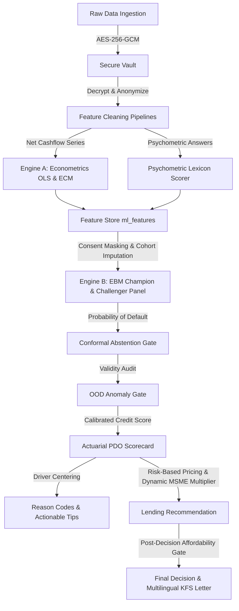
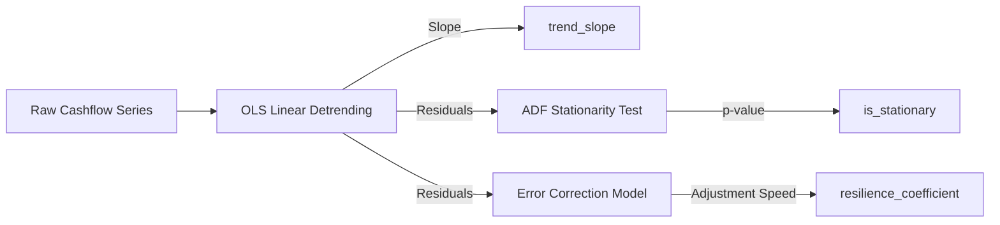

# Alternate Credit Engine: Comprehensive A-to-Z Model Reference Guide

This document provides a complete, line-by-line, file-by-file breakdown of the alternate credit scoring engine. It is designed to serve as an exhaustive reference for both technical stakeholders (auditors, risk engineers) and non-technical reviewers (policy makers, business leaders).

---

## High-Level Architecture Overview

The system evaluates the creditworthiness of thin-file borrowers (those who lack traditional credit history) using alternative data sources, such as telecom payment and recharge logs, e-commerce transaction histories, geolocation check-ins, bank cash flow records, and psychometric behavioral assessments. 

The evaluation pipeline is structured in a two-stage sequential process with pre-screening and safety gates:

1. **Bureau-Aware Pre-Screening:** Inspects the borrower's traditional bureau history (if available). Prime credit profiles are fast-tracked for approval, subprime profiles are immediately rejected, and thin-file borrowers are routed to the alternative credit pipeline.
2. **Engine A (Econometric & Statistical Cleaning):** Detrends volatile cash flow and payment series to isolate stable indicators of long-term growth and short-term resilience.
3. **Engine B (AI Champion/Challenger Panel & Safety Gates):** Feeds the preprocessed features into a glass-box Explainable Boosting Machine (EBM) model to calculate default probabilities. The EBM's decision is audited by a panel of CatBoost and Logistic Regression models.
4. **Safety & Integrity Gates:** Two post-scoring filters audit the output:
   * **Split Conformal Prediction:** Identifies high-uncertainty regions and blocks auto-approval of ambiguous profiles.
   * **OOD (Out-of-Distribution) Anomaly Detection:** Uses Mahalanobis distance with Ledoit-Wolf shrunk covariance to detect gamed or statistically anomalous feature combinations and route them to manual review.
5. **Scorecard Calibration & Terms:** Converts default probabilities into a standard 300–900 credit score using exact points reconciliation. It dynamically determines interest rates, tenures, and maximum serviceable EMI, applying a post-decision affordability gate if the request exceeds repayment capacity.

---

## Section 1: Value Proposition & Defensibility (The Win Conditions)

To satisfy risk officers, regulators, and data protection authorities, the platform integrates 9 core engineering decisions:

### 1. The Intrinsically Explainable Champion (Glass-Box EBM vs. Black-Box + SHAP)
* **Auditor/Regulator Concern:** *Post-hoc explanation tools like SHAP or LIME only approximate what a black-box model (like CatBoost) did. The actual decision logic remains opaque and cannot be published as a deterministic scorecard. How can regulators or risk officers audit the actual model?*
* **Our Solution:** We replaced the black-box champion with an **Explainable Boosting Machine (EBM)**. EBM is a generalized additive model (GAM) trained with boosting. Because it uses zero-interaction terms, its decision curves *are* the model itself. There is no post-hoc approximation: a risk officer can read risk weights directly off the shape curves and manually edit them if needed.
* **Performance Parity:** We achieved this transparency at **zero accuracy cost**, showing cross-validated AUC parity on synthetic profiles (EBM OOF CV AUC mean $0.645 \pm 0.177$ vs. CatBoost $0.574 \pm 0.151$).

### 2. Model Committee Audit Panel
* **Auditor/Regulator Concern:** *How can you trust a single model's probability call, especially when the borrower has a very thin credit file?*
* **Our Solution:** We run a **Champion-Challenger Panel** representing different model families: EBM (additive champion), CatBoost (tree-based challenger), and Logistic Regression (linear baseline). The system uses model disagreement as a signal: if the champion approves but the challengers disagree, the application triggers a manual review instead of an automatic release.

### 3. Conformal Prediction Set (Abstention Gate)
* **Auditor/Regulator Concern:** *What stops the AI from confidently auto-approving an applicant in a region of high data uncertainty?*
* **Our Solution:** We implement **Split Conformal Prediction** to calculate a distribution-free confidence set. If an applicant's default probability falls into an ambiguous range (where the model cannot statistically commit to either `approve` or `reject` at a $90\%$ coverage level), the system **abstains** and routes the applicant to manual review.

### 4. Out-of-Distribution (OOD) Anomaly Gate
* **Auditor/Regulator Concern:** *What stops a gamed applicant from pushing one or two features to flattering extremes while others stay mediocre, resulting in a false auto-approval?*
* **Our Solution:** Additive terms in an EBM extrapolate independently, meaning a joint feature vector that never occurred in training-where each coordinate is individually plausible but the combination is impossible-is scored blindly. We run a multivariate anomaly detector using **Mahalanobis Distance** on Ledoit-Wolf shrunk covariance. Anomalous feature combinations above a 99% training manifold threshold are blocked from auto-approval and routed to manual review.

### 5. Dynamic Population Re-Centering
* **Auditor/Regulator Concern:** *Your borrower portal shows only positive score drivers. Is this real explainability, or is it a feel-good marketing wrapper?*
* **Our Solution:** EBM is trained with balanced class weights, placing its raw math intercept at a $\approx 50\%$ coin-flip default probability (instead of the real portfolio base rate). Measured against this intercept, average borrowers appeared all-positive, leaving half of all borrowers with zero negative drivers. We dynamically re-center feature contributions against the average of the scored population (the "typical applicant"). This ensures score drivers show true strengths and adverse reasons relative to peers, while mathematically keeping the score reconciliation exact.

### 6. Time-Series Resilience vs. Static Volatility
* **Auditor/Regulator Concern:** *In thin-file lending, cash flow volatility is often penalized. But a borrower whose income is rapidly increasing will also show high volatility. How do you distinguish growth from instability?*
* **Our Solution:** We run a single-equation **Error Correction Model (ECM)** on detrended residuals. By first fitting an OLS linear trend line, we extract growth as a positive feature (`trend_slope`) and check the remaining fluctuations using the Augmented Dickey-Fuller (ADF) test. The ECM resilience coefficient ($\gamma$) calculates how fast a borrower recovers toward their trend after a cash-flow shock, rewarding financial bounce rather than penalizing growth.

### 7. Explicit Policy & Affordability Gates
* **Auditor/Regulator Concern:** *What stops a model from auto-approving a ₹10,00,000 loan request for a borrower who only has the cash-flow capacity to service ₹50,000?*
* **Our Solution:** We decouple risk scoring from risk policy. The risk model calculates default probability (PD), which calibrations map to interest rates and tenure. A separate post-decision **Affordability Gate** checks if the requested amount exceeds the borrower's serviceable principal (based on FOIR-adjusted bank income). If it does, the loan is blocked and routed to manual review for a counter-offer, keeping the core risk score unbiased.

### 8. Self-Report Honesty Feature
* **Auditor/Regulator Concern:** *Micro-merchants and gig workers can easily inflate their self-reported business turnovers during onboarding. How do you verify these numbers?*
* **Our Solution:** We don't score the turnover claim itself; we score its **consistency** with verified bank cash flows using a multi-tiered, cash-heavy, and vintage-aware validation logic that accommodates informal merchant dynamics:
  1. **Projection Phase (Tier 1):** For early-stage businesses operating under 6 months (`business_vintage_years < 0.5`), the consistency score is set to a neutral `1.0` to avoid penalizing new enterprises before bank records stabilize.
  2. **Cash-Heavy Sourcing Adjustment (Declared > Observed):** To account for cash-dominant operations, the system sets an expected digital ratio (the portion of turnover expected to flow through the bank account) based on the borrower cohort:
     * **Farmer:** 20% (0.20)
     * **Vendor / Homemaker:** 40% (0.40)
     * **Gig Worker / Student:** 80% (0.80)
     * **Salaried / Default:** 90% (0.90)
     * **Ramp-Up Grace (Tier 2):** If the business is between 6 months and 1.5 years old, a 50% grace factor is applied, halving the expected digital ratio.
     * **Target Observed Cashflow:** $I_{\text{expected}} = \text{Declared Turnover} \times \text{expected\_digital\_ratio}$.
     * **Score Calculation:** If observed bank income $I \ge I_{\text{expected}}$, the consistency score is `1.0`. Otherwise, it is:
       $$\text{turnover\_income\_consistency} = \frac{\text{Observed Income}}{I_{\text{expected}}}$$
  3. **Observed $\ge$ Declared:** If observed bank income exceeds the self-declared amount, the consistency is calculated as:
     $$\text{turnover\_income\_consistency} = \frac{\text{Declared Turnover}}{\text{Observed Income}}$$
  4. **Output Range:** The final consistency value is rounded to 4 decimal places and clamped between `0.0` and `1.0`. Any attempts to inflate declared turnover will drag the score down by reducing this ratio, rendering the self-report anti-gameable.

### 9. Vernacular Voice & Audio Inclusion (Closing the Accessibility Gap)
* **Auditor/Regulator Concern:** *How do you assess thin-file borrowers who are illiterate, cannot read English, or use budget devices without regional keyboard support?*
* **Our Solution:** The intake portal features a **Vernacular Voice Router** using Speech-to-Text and Text-to-Speech in English, Hindi, and Bengali. It reads prompt text in natural local voices and lets borrowers speak answers. To handle devices without regional keyboards, we provide an in-page virtual keyboard layout with Devanagari and Bengali characters.

---

## Section 2: Data Ingestion, Security, & Consent (DPDP Compliance)

### 1. Cryptographic Security & Vault Ingestion
* **Files:** [core/security.py](file:///c:/Users/gsran/OneDrive/Desktop/alt-credit-engine/core/security.py), [models/db_models.py](file:///c:/Users/gsran/OneDrive/Desktop/alt-credit-engine/models/db_models.py) (SecureVault), [api/routes/ingestion.py](file:///c:/Users/gsran/OneDrive/Desktop/alt-credit-engine/api/routes/ingestion.py)
* **Under the Hood:**
  Raw financial payloads (utility invoices, geolocations, statements) are encrypted at the API boundary using **AES-256-GCM** before database write. The decryption keys are separated in memory. Decrypted data is never exposed directly; background tasks extract anonymous numbers into derived features, leaving the original payloads isolated.

### 2. Cascading Consent Revocation (DPDP Act 2023)
* **File:** [api/routes/consent.py](file:///c:/Users/gsran/OneDrive/Desktop/alt-credit-engine/api/routes/consent.py), [convergence/score_engine.py](file:///c:/Users/gsran/OneDrive/Desktop/alt-credit-engine/convergence/score_engine.py)
* **Under the Hood:**
  Borrowers act as Data Principals, and the platform operates as a Data Fiduciary. Under DPDP Act §6, the platform supports both general consent revocation and **granular sub-scopes** added in July 2026:
  * `upi_lite` (UPI Lite transactions)
  * `dbt_logs` (Direct Benefit Transfer welfare deposits)
  * `sms_parsing` (On-device transaction SMS parsing)
  * `enam_receipts` (e-NAM Agri Mandi receipts)
  
  If a borrower revokes a specific data scope or granular toggle, the system performs a **cascading purge** of the raw encrypted vault files and masks the derived model features to `NaN`. Masked features are imputed to cohort-typical averages at model run, ensuring the borrower looks average (rather than worst-case) on the revoked scope, preventing points-based penalties.
* **Audit Trail Retention:** Under RBI regulations, score records (`ScoreDecision`) are retained for 5 years in an anonymized state, while the raw personal payloads in `SecureVault` are immediately deleted upon an erasure request (DPDP Act §17).

### 3. RBI Account Aggregator (AA) & DPDP-Compliant Flow
* **File:** [api/routes/consent.py](file:///c:/Users/gsran/OneDrive/Desktop/alt-credit-engine/api/routes/consent.py)
* **Under the Hood:**
  The platform simulates the RBI Account Aggregator (AA) framework for DPDP-compliant data sharing:
  * **Consent Authorization (`/consent/authorize`):** Initiates a secure consent request, defining the Data Fiduciary (`Alt-Credit Engine (Demo AA)`), the Purpose (`Alternate creditworthiness assessment for thin-file loan origination`), explicit consent scopes, and expiration (24 hours TTL).
  * **Token Exchange (`/consent/token`):** Exchanges authorized consent codes for transient access tokens mapping to active scopes, strictly enforcing access controls.
  * **Privacy Dashboard (`/consent/status/{user_id}`):** Allows borrowers to view active vs. revoked scopes, check data erasure status, and verify vault data presence.
  * **Compliance Summary (`/consent/compliance`):** Outlines regulatory alignments (RBI AA framework, DPDP Act 2023, RBI Digital Lending Guidelines 2022) and borrower rights (revocation, erasure, and anonymized score retention audit trails).

---

## Section 3: Data Preprocessing & Feature Extraction

### 1. Telecom Cleaning & Prepaid Latency
* **File:** [preprocessing/clean_telecom.py](file:///c:/Users/gsran/OneDrive/Desktop/alt-credit-engine/preprocessing/clean_telecom.py)
* **Under the Hood:**
  * **Postpaid Bill Delay:** Extracts delay relative to due dates: $\text{delta} = \text{payment\_date} - \text{due\_date}$. Delays $\le 3$ days carry a grace period; delays beyond this accumulate to output `avg_days_late` and `missed_payments_count`.
  * **Prepaid Recharge Latency:** For prepaid accounts (common among thin-file borrowers), the preprocessor measures the delay in recharges post-expiration, blending this latency into the `avg_days_late` feature.
  * **SIM Vintage:** Measures time since SIM activation. A vintage under 12 months reflects flight risk and adds a penalty to the `missed_payments_count` feature.

### 2. E-Commerce Volatility & Address Drift
* **File:** [preprocessing/clean_ecommerce.py](file:///c:/Users/gsran/OneDrive/Desktop/alt-credit-engine/preprocessing/clean_ecommerce.py)
* **Under the Hood:**
  * **Necessity Ratio:** Categorizes merchant codes into necessity (groceries, utilities, health, education) and discretionary spend.
  * **Shipping Address Drift:** Evaluates residential stability without using battery-draining GPS tracking by calculating the normalized Shannon entropy of delivery PIN codes from order logs:
    $$\text{Entropy} = \frac{-\sum p_i \log_2(p_i)}{\log_2(k)}$$
    where $p_i$ is the order frequency to PIN $i$, and $k$ is the unique PIN count. Low entropy represents high stability (consistently shipping to home/work), mapped directly to `spatial_variance_score` and `anchor_count`.

### 3. Geolocation & Spatial Variance
* **File:** [preprocessing/clean_geo.py](file:///c:/Users/gsran/OneDrive/Desktop/alt-credit-engine/preprocessing/clean_geo.py)
* **Under the Hood:**
  To evaluate geographic stability while keeping calculations lightweight and deterministic:
  1. **Cell Grid PIN Mapping:** Coordinates are mapped deterministically to a stable 6-digit PIN code using a cell grid size of $0.5$ degrees:
     $$\text{row} = \lfloor(\text{lat} - 8.0) / 0.5\rfloor$$
     $$\text{col} = \lfloor(\text{long} - 68.0) / 0.5\rfloor$$
     $$\text{PIN} = 110000 + ((\text{row} \times 60 + \text{col}) \times 7 \bmod 889999)$$
  2. **Spatial Variance Score:** Calculates the normalized Shannon entropy of these location PINs to measure delivery/check-in address drift:
     $$\text{Entropy} = \frac{- \sum p_i \log_2(p_i)}{\log_2(k)}$$
     where $p_i$ is the frequency of orders/check-ins at PIN cell $i$, and $k$ is the count of unique PIN codes. Low entropy reflects high residential/occupational stability, represented as `spatial_variance_score`.
  3. **Location Anchors:** Counts the total number of unique check-in PIN cells, mapped to the `anchor_count` feature.
  *(Note: DBSCAN clustering and Haversine distance represent legacy models, whereas the cell-grid deterministic approach is implemented in the active preprocessor for performance and robust alignment with e-commerce PIN entropy.)*

### 4. Bank Cash Burn & Welfare Parsing
* **Under the Hood:**
  * **Cash Burn Rate:** Measures consumption velocity post-payday. Within a $[T, T+7]$ window after salary credit:
    $$\text{Burn Rate} = \frac{\sum \text{Debits in post-payday window}}{\text{Credited Income Amount}}$$
    Averages monthly ratios as `cash_burn_rate`. A high ratio indicates impulsive spending and low financial discipline.
  * **UPI Lite Sourcing:** Parses transactions matching patterns like `UPI-LITE/` or `LITE-WALLET/` to count frequency (`upi_lite_txn_count`) and ticket size (`upi_lite_average_ticket`). This isolates micro-payments so they are not misclassified as general cash outflows.
  * **Direct Benefit Transfer (DBT):** Welfare deposits (e.g. `DBT/PM-KISAN`) are parsed to compute `dbt_income_consistency` (ratio of months with deposits), establishing a reliable rural income floor.
  * **e-NAM Receipts:** Integrates National Agriculture Market verified mandi receipt volumes (`enam_receipt_volume`) directly into agricultural cohort features as verified proof-of-income.

### 5. On-Device Transactional SMS Parsing
* **Under the Hood:**
  Measures payment latency (`sms_bill_delay`) as elapsed days between a bill alert SMS and a payment confirmation message. It sums merchant keywords (Amazon, Flipkart) to compute `sms_spend_total`.

### 6. Borrower Onboarding Business Profile
* **File:** [core/business_profile.py](file:///c:/Users/gsran/OneDrive/Desktop/alt-credit-engine/core/business_profile.py)
* **Under the Hood:**
  Extracts `business_vintage_years` and monthly declared turnover ($T$) from free-text descriptions via LLM parsing (with a local regex fallback). Declared turnover is compared to bank-verified cash inflow ($I$) using the cash-heavy, vintage-aware consistency ratio detailed in the Self-Report Honesty Feature section (adapting to cohort-specific digital ratios). Declared amounts are never rewarded; only the consistency between self-reported and bank-observed income earns points. Business profile fields are available to Vendors, Farmers, Gig Workers, and Homemakers stating a `small_home_business` purpose.

### 7. Live Location Verification
* **File:** [api/routes/consent.py](file:///c:/Users/gsran/OneDrive/Desktop/alt-credit-engine/api/routes/consent.py)
* **Under the Hood:**
  The portal provides a `/verify-live-location` endpoint that acts as a check-in validation. It takes HTML5 latitude and longitude coordinates submitted during onboarding, converts them to a PIN code using `latlong_to_pincode`, and compares them with the user's most frequent e-commerce delivery PIN code from historical order records. If they match, the location is verified; if they mismatch, a `location_mismatch` warning is raised.

### 8. ONDC & Partner UPI Merchant Sourcing
* **Under the Hood:**
  To retrieve transaction velocity and business credit features for informal micro-merchants (street vendors, small shop owners) who lack formal bank statements, the system integrates with ONDC APIs (ratings and order volumes), partner UPI QR dashboards (e.g., BharatPe / PhonePe payment velocities), and B2B distributor platforms (purchase invoicing histories) to extract features like `daily_transaction_count` and `average_ticket_size`.

---

## Section 4: Engine A - Time-Series Econometric Analysis

* **File:** [models_econometric/ecm_model.py](file:///c:/Users/gsran/OneDrive/Desktop/alt-credit-engine/models_econometric/ecm_model.py)
* **Under the Hood:**
  Processes bank net cash flows to isolate long-term growth from short-term volatility:

### 1. OLS Linear Detrending
We fit a linear trend line using Ordinary Least Squares (OLS) over the series length $T$:
$$y_t = \alpha + \beta \cdot t + \epsilon_t$$
* **Slope Extraction:** The trend slope is normalized by the series mean:
  $$\text{trend\_slope} = \frac{\beta}{\bar{y}}$$
* **Residual Calculation:** We subtract the trend line to isolate detrended residuals:
  $$y_t^{\text{detrended}} = y_t - (\alpha + \beta \cdot t)$$

### 2. Augmented Dickey-Fuller (ADF) Stationarity Test
We run the ADF test on detrended residuals to check if the fluctuations are stable around the trend:
$$\Delta y_t^{\text{detrended}} = \alpha_0 + \theta y_{t-1}^{\text{detrended}} + \sum_{i=1}^p \phi_i \Delta y_{t-i}^{\text{detrended}} + \epsilon_t$$
* **Hypothesis:** We test whether the coefficient $\theta = 0$ (unit root / non-stationary).
* **Feature Output:**
  $$\text{is\_stationary} = \begin{cases} 1.0 & \text{if } p\text{-value} < 0.05 \\ 0.0 & \text{otherwise} \end{cases}$$

### 3. Error Correction Model (ECM)
We estimate a single-equation ECM on the detrended residuals to measure recovery speed after a shock:
$$\Delta y_t^{\text{detrended}} = \alpha_0 + \gamma \left(y_{t-1}^{\text{detrended}} - \bar{y}^{\text{detrended}}\right) + \epsilon_t$$
* **Resilience Coefficient Math:**
  $$\text{resilience\_coefficient} = \text{clamp}(-\gamma, 0.0, 1.0)$$
  If the residuals are stationary, we add a $+0.1$ stability bonus:
  $$\text{resilience\_coefficient} = \min(1.0, \text{resilience\_coefficient} + 0.1 \cdot \text{is\_stationary})$$

---

## Section 5: Behavioral Assessment & Psychometric Scoring

### 1. Item Bank & Onboarding Controls
* **Files:** [psychometric/bank.py](file:///c:/Users/gsran/OneDrive/Desktop/alt-credit-engine/psychometric/bank.py), [psychometric/session.py](file:///c:/Users/gsran/OneDrive/Desktop/alt-credit-engine/psychometric/session.py)
* **Under the Hood:**
  Manages the intake survey. To prevent rehearsal and gaming, the system enforces a rate limit: **a borrower is capped at 1 application per 30 days**. The rate limit error returns a formatted natural TTS date (e.g., "5 August 2026") so voice readers state the date naturally.

### 2. Multi-lingual Text Lexicon Scoring
* **File:** [psychometric/scoring.py](file:///c:/Users/gsran/OneDrive/Desktop/alt-credit-engine/psychometric/scoring.py)
* **Under the Hood:**
  Transcripts of spoken answers are sent to Groq (`llama-3.1-8b-instant`) which parses regional code-mixed transliterations (e.g., "रेंट", "इंटरेस्ट") natively.
  * **Offline Lexicon Fallback:** If Groq is offline, a local keyword engine scores the text. It matches English words using strict boundaries (`\b`), while matching Devanagari (Hindi) and Bengali as *substrings* to handle regional vowel attachments, suffixes, and inflections.
  * **Negation Window:** The local parser scans for negation particles (`not`, `never`, `nahi`, `na`, `mat`) within a sliding window of $\pm 2$ words on either side of keywords, flipping the responsible/avoidant tag polarity.
  * **Response Validity Check:** Calculates absolute differences between scores on paired control statements to flag inconsistent or random answers:
    $$\text{response\_validity} = \frac{1}{|P|}\sum_{(a,b) \in P} \max\left(0.0, 1.0 - 2 \cdot |S_a - S_b|\right)$$

---

## Section 6: Engine B - AI Model Panel & Conformal Safety Net

### 1. Cohort-Aware Imputation Profile
* **File:** [models_ai/imputation.py](file:///c:/Users/gsran/OneDrive/Desktop/alt-credit-engine/models_ai/imputation.py)
* **Under the Hood:**
  Thin-file borrowers are missing entire data sources by design. Zero-filling these missing values acts as a penalty. This module replaces missing values with the median of the borrower's **own cohort** (calculated at training time and persisted in `imputation_stats.json`):
  1. Identifies the borrower's cohort (e.g., `Student`, `Farmer`).
  2. If the feature is missing but applicable, it fills it with the cohort median (e.g., a student missing utility records receives the typical student utility payment rate).
  3. If the feature is structurally not applicable (e.g., business vintage for a salaried individual), the cohort median is undefined, and it remains a neutral `0.0`.

### 2. Explainable Boosting Machine (EBM)
* **File:** [models_ai/ebm_model.py](file:///c:/Users/gsran/OneDrive/Desktop/alt-credit-engine/models_ai/ebm_model.py)
* **Under the Hood:**
  The champion model is a generalized additive model (GAM). It calculates default probability without complex feature interactions:
  $$\text{logit}(PD) = \ln\left(\frac{PD}{1 - PD}\right) = \beta_0^{\text{corrected}} + \sum_{i=1}^D f_i(x_i)$$
  Because it is additive, the exact risk weights ($f_i(x_i)$) can be plotted as curves and audited.

### 3. Post-Hoc Temperature Scaling (Calibration)
* **File:** [models_ai/tempering.py](file:///c:/Users/gsran/OneDrive/Desktop/alt-credit-engine/models_ai/tempering.py)
* **Under the Hood:**
  We divide EBM logits by a temperature parameter $T \ge 1$ to calibrate probabilities. We perform a grid search over $T \in [1.0, 6.0]$ to minimize Brier score loss on a calibration split:
  $$\text{Brier Loss}(T) = \frac{1}{N}\sum_{i=1}^N \left(\sigma\left(\beta_0 + \frac{\sum f_i(x_i)}{T}\right) - y_i\right)^2$$
  The EBM shape curves are scaled: $f_i^{\text{tempered}}(x_i) = f_i(x_i) / T_{\text{ebm}}$.

### 4. Split Conformal Prediction (Abstention Gate)
* **File:** [models_ai/conformal.py](file:///c:/Users/gsran/OneDrive/Desktop/alt-credit-engine/models_ai/conformal.py)
* **Under the Hood:**
  1. Compute nonconformity scores on a calibration holdout set (20% of training data):
     $$S_i = \begin{cases} 1 - PD_i & \text{if } y_i = 1 \text{ (default)} \\ PD_i & \text{if } y_i = 0 \text{ (no default)} \end{cases}$$
  2. For a target coverage level $1 - \alpha = 90\%$ ($\alpha = 0.10$), calculate the quantile threshold:
     $$q = \text{Quantile}\left(\{S_i\}_{i=1}^n, \frac{\lceil(n+1)(1-\alpha)\rceil}{n}\right)$$
     *Note: To prevent small calibration sets from causing full-portfolio abstention, $q$ is capped at $0.980000$ for safety.*
  3. For a new borrower with default probability $PD^*$:
     * Include `no_default` in the prediction set $C(x)$ if $PD^* \le q$.
     * Include `default` in the prediction set $C(x)$ if $PD^* \ge 1 - q$.
  4. If $PD^*$ satisfies both conditions ($1 - q \le PD^* \le q$), the prediction set contains **both** labels ($C(x) = \{\text{no\_default}, \text{default}\}$). The system abstains (`abstain = True`) and overrides any automatic approval, routing the application to manual review.

### 5. Out-of-Distribution (OOD) Anomaly Gate
* **File:** [models_ai/ood.py](file:///c:/Users/gsran/OneDrive/Desktop/alt-credit-engine/models_ai/ood.py)
* **Under the Hood:**
  1. Measures the applicant's **Mahalanobis Distance** from the joint training manifold:
     $$D^2(x) = (x - \mu)^T \Sigma^{-1} (x - \mu)$$
  2. Uses **Ledoit-Wolf Shrunk Covariance** to ensure the collinear, high-dimensional feature matrix remains stable and invertible.
  3. If $D^2(x) > \text{threshold}$ (calculated at the `quantile=0.99` training manifold threshold), `ood = True` is triggered.
  4. If `ood = True` and the model decision is `APPROVE`, the decision is demoted to `REVIEW`, preventing auto-approval of gamed profiles.

---

## Section 7: Mathematical Point Conversion & Center-Attribution

To satisfy regulatory explainability requirements, credit scores reconcile exactly with their score driver tables. The scorecard converts EBM log-odds into additive scorecard points.

### 1. Actuarial Scorecard Scaling (Points-to-Double-the-Odds)
* **File:** [convergence/scorecard.py](file:///c:/Users/gsran/OneDrive/Desktop/alt-credit-engine/convergence/scorecard.py)
* **Under the Hood:**
  * **Scorecard Constants:**
    * $\text{BASE\_SCORE} = 600$
    * $\text{BASE\_ODDS} = 10.0$ (good to bad ratio, default probability of $1 / (1 + 10) \approx 9.09\%$).
    * $\text{PDO} = 50$ (points required to double the odds of a good borrower).
  * **Factor and Offset:**
    $$F = \frac{\text{PDO}}{\ln(2)} \approx 72.13475$$
    $$C = \text{BASE\_SCORE} - F \cdot \ln(\text{BASE\_ODDS}) \approx 433.914$$
  * **Log-Odds to Credit Score:**
    $$\text{Score} = C - F \cdot \ln\left(\frac{PD}{1 - PD}\right)$$
    $$\text{Credit Score} = \max(300, \min(900, \text{round}(\text{Score})))$$

### 2. Dynamic Centering (The "All-Green Wall" Correction)
Because the EBM is trained with balanced class weights, its raw intercept sits at $\approx 50\%$ default probability. Measured against this, average borrowers appeared all-positive, leaving half of all borrowers with zero negative drivers.
  
To address this, we re-center the contributions against the typical applicant's baseline $b_i$:
1. Compute the population-average contribution per feature (the typical applicant):
   $$b_i = \frac{1}{M}\sum_{j=1}^M f_i(x_{j, i})$$
2. Subtract this baseline from each borrower's raw feature contribution:
   $$\text{centered\_contribution}_i = f_i(x_i) - b_i$$
3. Shift the intercept to maintain score reconciliation:
   $$\beta_0^* = \beta_0^{\text{corrected}} + \sum_{i=1}^D b_i$$
4. Compute scorecard points:
   $$\text{points}_i = -F \cdot \text{centered\_contribution}_i$$
   $$\text{base\_points} = C - F \cdot \beta_0^*$$
   $$\text{Score} = \text{base\_points} + \sum_{i=1}^D \text{points}_i$$
5. Personal adverse action codes are generated from features where $\text{centered\_contribution}_i > 0$ (borrower's risk is higher than average). These adverse drivers are **sorted first** in the UI, ensuring rejected applicants see real reasons for rejection rather than a list of positive features.

---

## Section 8: Convergence, Scorecard, & Decisioning

### 1. Bureau-Aware Pre-Screening Gate
* **File:** [convergence/score_engine.py](file:///c:/Users/gsran/OneDrive/Desktop/alt-credit-engine/convergence/score_engine.py)
* **Under the Hood:**
  Prior to running alternative credit preprocessing and ML scoring, the engine checks the borrower's traditional CIBIL score:
  * **Prime Fast-Track:** If the CIBIL score is $\ge 750$, the application is immediately approved (`APPROVE`) with a default probability of 0.01 and a prime interest rate of 11.0% over 36 months, bypassing all alternative pipelines.
  * **Subprime Auto-Reject:** If the CIBIL score is $< 600$, the application is immediately rejected (`REJECT`) with a default probability of 0.99, bypassing all models.
  * **Alternative Routing Fallback:** If the CIBIL score is between 600 and 749, or is missing/thin-file (`-1` or None), the application is routed to the alternate credit scorecard pipeline.

### 2. Cohort Score Range Limits & Calibration Adjustment
* **File:** [convergence/score_engine.py](file:///c:/Users/gsran/OneDrive/Desktop/alt-credit-engine/convergence/score_engine.py)
* **Under the Hood:**
  Each borrower cohort is constrained to a specific score range (`COHORT_SCORE_RANGES`) based on historical risk caps and lending policies:
  * **Student:** 330–720
  * **Homemaker:** 360–730
  * **Farmer:** 330–800
  * **Vendor:** 330–850
  * **Salaried:** 400–850
  * **GigWorker:** 350–760

  If the raw score calculated from the champion's default probability falls outside these limits, it is clamped:
  $$\text{Credit Score} = \text{clamp}(\text{Raw Score}, \text{Min Score}, \text{Max Score})$$
  When a clamp occurs, the difference is recorded as a `cohort_adjustment` ("Cohort-level risk cap adjustment") and the default probability is back-calculated from the clamped score to maintain exact scorecard mathematical reconciliation:
  $$\text{log\_odds\_calibrated} = \frac{\text{SCORE\_OFFSET} - \text{Credit Score}}{\text{PDO\_FACTOR}}$$
  $$PD_{\text{calibrated}} = \frac{1}{1 + e^{-\text{log\_odds\_calibrated}}}$$

### 3. Decision Band Cutoffs
* **File:** [convergence/panel.py](file:///c:/Users/gsran/OneDrive/Desktop/alt-credit-engine/convergence/panel.py)
* **Under the Hood:**
  * **APPROVE Cutoff:** Credit score $\ge 700$ (representing PD $\le 2.5\%$).
  * **REVIEW Cutoff:** Credit score $\ge 560$.
  * **REJECT Cutoff:** Credit score $< 560$.

### 4. Model Committee Agreement Gate
* **File:** [convergence/panel.py](file:///c:/Users/gsran/OneDrive/Desktop/alt-credit-engine/convergence/panel.py)
* **Under the Hood:**
  Auto-decisions require panel support. The system only overrules the EBM champion when the panel **genuinely conflicts**, not for adjacent boundary scatter (e.g., EBM says `APPROVE`, and a challenger says `REVIEW`).
  * **Hard Conflict Veto:** If the champion (EBM) approves but any challenger (CatBoost or Logistic) rejects (or vice versa), the application is routed to `REVIEW`.

### 5. Actuarial Lending Terms Calibrations
* **File:** [convergence/lending.py](file:///c:/Users/gsran/OneDrive/Desktop/alt-credit-engine/convergence/lending.py)
* **Under the Hood:**
  * **Risk-Based Interest Rate:**
    $$\text{rate} = 11.0\% + 20.0\% \cdot PD \quad (\text{clamped between } 11\% \text{ and } 26\%)$$
  * **Tenure Selection:**
    Tenures are dynamically recommended based on the final credit score to protect against default risk on lower-rated loans:
    * Credit Score $\ge 640$: **36 months**
    * Credit Score $\ge 580$: **24 months**
    * Credit Score $\ge 480$: **18 months**
    * Credit Score $< 480$: **12 months**
  * **Repayment Capacity (FOIR):**
    $$\text{FOIR} = 0.45 \cdot (1 - PD) \quad (\text{clamped between } 10\% \text{ and } 45\%)$$
    * **Review Adjustment:** If the decision is `REVIEW`, we reduce the FOIR by 30%:
      $$\text{FOIR}_{\text{review}} = \text{FOIR} \cdot 0.7$$
    * **MSME Capacity Multiplier:** If the borrower is an MSME (catered by the `borrower_type` flag $\ge 0.5$), we scale up their monthly income to reflect unrecorded cash turnover. The multiplier is the inverse of the cohort's expected digital ratio (capped at 3.0):
      $$\text{Income}_{\text{adjusted}} = \text{Income}_{\text{observed}} \cdot \text{Multiplier}$$
      * *Farmer:* expected digital ratio 0.20 $\rightarrow$ **3.0×** multiplier.
      * *Vendor / Homemaker:* expected digital ratio 0.40 $\rightarrow$ **2.5×** multiplier.
      * *GigWorker / Student:* expected digital ratio 0.80 $\rightarrow$ **1.25×** multiplier.
      * *Others:* **1.5×** multiplier.
    * **Maximum Monthly EMI:** $\text{EMI}_{\text{max}} = \text{Income}_{\text{adjusted}} \cdot \text{FOIR}$.
    * **Maximum Loan Principal ($P$) for Tenure $N$:**
      $$P = \text{Income}_{\text{adjusted}} \cdot \text{FOIR} \cdot \frac{(1 + r)^N - 1}{r(1 + r)^N} \quad (\text{where } r = \text{rate}/1200)$$

### 6. Post-Decision Affordability Gate
* **File:** [convergence/lending.py](file:///c:/Users/gsran/OneDrive/Desktop/alt-credit-engine/convergence/lending.py)
* **Under the Hood:**
  If the EBM champion approves the loan, but the requested loan amount exceeds the maximum serviceable principal ($P$):
  1. The auto-approval is blocked (`gated = True`).
  2. The final lending outcome is set to `REVIEW`.
  3. The audit trail stores the model's decision (`APPROVE`) and the final outcome (`REVIEW`) separately, ensuring policy overlays do not bias the core risk model.

### 7. Deterministic Adverse-Action Letters
* **File:** [convergence/decision_letter.py](file:///c:/Users/gsran/OneDrive/Desktop/alt-credit-engine/convergence/decision_letter.py)
* **Under the Hood:**
  Rejections and review cases queue for a loan officer, who reviews and signs the letter. Approvals are auto-issued.
  * **Deterministic Drafting:** The letter is drafted **deterministically** from the same reason codes the model produced (never by an LLM) to prevent hallucinations.
  * **INDIC Translation & i18n Dates:** Decodes English reasons into Hindi or Bengali templates. All dates in the letter (e.g., signature dates) render in the borrower's local language (e.g., "5 अगस्त 2026" or "5 আগস্ট 2026") instead of ISO strings.

---

## Section 9: Borrower Cohort Operations & Feature Schema

### 1. Cohort-Specific Workflows & Expected Facets

| Borrower Cohort | Core Profile & Platform Workflow | Expected Facets (0–100 Scores) | Special Risk Rules & Adjustments |
|:---|:---|:---|:---|
| **Salaried** | High-density formal data. Onboards via statements and bills. | Telecom, E-commerce, Geolocation, Cashflow, Psychometrics | Missed telecom payments limit: $\ge 5$ payments late = auto-reject. |
| **Gig Worker** | High-frequency, volatile incomes. Onboards via gig platform integrations. | Telecom, E-commerce, Geolocation, Cashflow, Psychometrics | **Dynamic Weight Tuning:** EBM weights cashflow volatility less (0.05) and mean income/resilience higher (0.35 each). |
| **Student** | Thin-file, zero formal income. Onboards via campus ID and digital wallet logs. | Geolocation, Psychometrics, Campus UPI Behavior | Imputes missing cash-flow income to the typical student average (₹5,000) instead of penalizing. |
| **Vendor** | Micro-merchants and street vendors. Onboards via business description + UPI logs. | Geolocation, Psychometrics, Vendor UPI Velocity, Business Credentials | **MSME Capacity Multiplier:** Scales observed monthly cash flow by **2.5×** to calculate true repayment capacity. |
| **Farmer** | Seasonal agricultural workers. Onboards via farming crop type + purchase invoices. | Geolocation, Psychometrics, Agricultural Seasonality, Business Credentials | **MSME Capacity Multiplier:** Scales observed monthly cash flow by **3.0×**. Harvest income spikes are modeled as expected seasonal patterns. |
| **Homemaker** | Informal/dependent household spenders. Onboards via utility accounts and household purchase logs. | Telecom, Geolocation, Psychometrics, Household Reliability | Evaluates utility bill payment consistency and grocery spend stability rather than cash inflows. |

---

### 2. Complete Model Feature Schema (42 Features)
Every borrower is evaluated using a subset of the following 42 features:

1. **Telecom Reliability (3 features):**
   * `avg_days_late` (Low is better): Average postpaid payment delay or prepaid recharge latency.
   * `missed_payments_count` (Low is better): Number of unpaid invoices, including SIM vintage penalties for vintage < 12 months.
   * `sms_bill_delay` (Low is better): Payment delay elapsed between bill alerts and confirmation SMS.
2. **Spending Behaviour (4 features):**
   * `necessity_ratio` (High is better): Ratio of essential vs. discretionary purchases.
   * `avg_merchant_rating` (High is better): Star quality score of historical e-commerce vendors.
   * `monthly_spend_volatility` (Low is better): Standard deviation of monthly order totals.
   * `sms_spend_total` (High is better): Sum of all e-commerce transaction values parsed from on-device SMS.
3. **Location Stability (2 features):**
   * `spatial_variance_score` (Low is better): Shannon entropy of shipping address zip codes from order logs.
   * `anchor_count` (High is better): Count of unique shipping destination PIN codes.
4. **Cashflow Resilience (12 features):**
   * `monthly_income_mean` (High is better): Average monthly cash inflow.
   * `monthly_expense_mean` (Low is better): Average monthly cash outflow.
   * `cashflow_volatility` (Low is better): Volatility (standard deviation of weekly net cash flows).
   * `cash_burn_rate` (Low is better): Average ratio of debits in post-payday window $[T, T+7]$ to credited income.
   * `resilience_coefficient` (High is better): ECM error correction speed ($\gamma$) plus stationarity bonus.
   * `adf_statistic` (Low is better): Stationarity test value on detrended residuals.
   * `adf_pvalue` (Low is better): Significance level of stationarity.
   * `is_stationary` (High is better): Boolean flag indicating stable residual cash flow.
   * `trend_slope` (High is better): Normalized growth slope of the cash-flow trend line.
   * `upi_lite_txn_count` (High is better): Count of UPI Lite wallet load debits.
   * `upi_lite_average_ticket` (High is better): Average ticket size of UPI Lite wallet loads.
   * `dbt_income_consistency` (High is better): Ratio of months with Direct Benefit Transfer welfare deposits.
5. **Psychometric Character (6 features in ML table, 10 constructs reported in UI):**
   * *ML Model Features:* `conscientiousness`, `locus_of_control`, `financial_self_efficacy`, `present_bias` (Low is better), `debt_attitude`.
   * *Reported constructs (UI only):* `risk_tolerance` (Low is better), `delayed_gratification`, `honesty`, `cognitive_reflection`, `resourcefulness`.
   * `response_validity` (High is better): Consistency rate between paired control statements.
6. **Campus Transaction Behavior (3 features):**
   * `upi_spend_consistency` (High is better): Consistency of campus-wallet digital payments.
   * `small_dues_payment_promptness` (High is better): Prompt repayment of small digital/campus dues.
   * `e_wallet_topup_frequency` (High is better): Rate of mobile/digital wallet topups.
7. **Vendor Transaction Velocity (2 features):**
   * `daily_transaction_count` (High is better): Average daily merchant sales transactions.
   * `average_ticket_size` (High is better): Mean value of individual merchant sales.
8. **Agricultural Seasonality (3 features):**
   * `harvest_income_spike` (High is better): Crop sales cycle spikes aligned with seasonal periods.
   * `input_purchase_consistency` (High is better): Purchase frequency of crop inputs.
   * `enam_receipt_volume` (High is better): Volume of verified crop sales from e-NAM receipts.
9. **Household Reliability (2 features):**
   * `utility_payment_consistency` (High is better): On-time rate of home utility bill payments.
   * `grocery_spend_stability` (High is better): Regularity of monthly household grocery budgets.
10. **Business Credentials (5 features):**
    * `business_vintage_years` (High is better): Years operating the enterprise.
    * `turnover_income_consistency` (High is better): Ratio of self-declared turnover to bank-observed cash flow.
    * `has_udyam_registration` (High is better): Boolean status of Udyam registration.
    * `years_informal` (High is better): Years operating without formal registration.
    * `is_new_business` (Low is better): Boolean indicating if the business is under 1 year old.

---

### 3. Cohort UI Lineage Filtering
* **Under the Hood:**
  To prevent reviewer confusion, the score explainer page filters out features belonging to scopes not expected for the active cohort. Previously, all point contributions from the hidden, non-applicable features were aggregated into a single line item: **"Cohort Baseline Adjustments"**. This line item has been removed from the explainer page to streamline presentation, though all point contributions still sum correctly to the final credit score mathematically under the hood.

---

## Section 10: UI Visualization & Translation

Both the Bank Officer Dashboard and the Borrower Portal translate raw numbers into visual, actionable elements:

### 1. Bank Officer Dashboard Elements ([dashboard.html](file:///c:/Users/gsran/OneDrive/Desktop/alt-credit-engine/frontend/dashboard.html))
* **Portfolio Metrics:** Total borrowers, Approval rate (under the model decision, ignoring post-decision affordability gates), Expected Default Rate (EDR) (average PD), and Avg Score.
* **Score Distribution Chart:** Grouping credit scores into bands: Reject ($<560$), Review ($560\text{--}699$), and Approve ($\ge 700$).
* **Fairness Monitor (80% Rule):** Compares the approval rate of protected vs. majority groups across groupings (Borrower category, Gender, Geography, Social category).
  * **Protected Isolation:** Demographic fields are monitoring-only and are never used as model inputs. The default view displays borrower category (`Individual` vs. `MSME`) to focus on business segment.
  * **Decision Parity:** Parity is computed on the core model decision (`APPROVE` / `REJECT`), not the post-decision outcome (`final_outcome`), isolating underwriting bias from requested loan size.
  * **Small-Cohort Suppression:** Groups with fewer than 5 members are excluded from the disparate impact calculation to prevent statistical noise.
  * **80% Rule Equation:** If the approval rate ratio between the lowest-performing and highest-performing group is less than 0.8, the dashboard flags a disparate impact warning:
    $$\text{DI Ratio} = \frac{\min(\text{Approval Rates})}{\max(\text{Approval Rates})} < 0.8$$
* **Winsorized Radar Score Facets:** Groups features into 10 possible facets. The raw values are winsorized between the population's 10th and 90th percentiles to map them to a $0\text{--}1$ goodness scale:
  * For "High is Better" features: $\text{Goodness} = \text{clamp}\left(\frac{\text{Value} - P_{10}}{P_{90} - P_{10}}, 0.0, 1.0\right)$
  * For "Low is Better" features: $\text{Goodness} = \text{clamp}\left(\frac{P_{90} - \text{Value}}{P_{90} - P_{10}}, 0.0, 1.0\right)$
  * **Facet Sub-Score Weighting Schema:**
    1. **Telecom Reliability:** `avg_days_late` (30%), `missed_payments_count` (40%), `sms_bill_delay` (30%)
    2. **Spending Behaviour:** `necessity_ratio` (30%), `avg_merchant_rating` (20%), `monthly_spend_volatility` (20%), `sms_spend_total` (30%)
    3. **Location Stability:** `spatial_variance_score` (60%), `anchor_count` (40%)
    4. **Cashflow Resilience:** `monthly_income_mean` (15%), `cash_burn_rate` (15%), `cashflow_volatility` (10%), `resilience_coefficient` (15%), `trend_slope` (15%), `is_stationary` (5%), `upi_lite_txn_count` (10%), `upi_lite_average_ticket` (5%), `dbt_income_consistency` (10%)
    5. **Psychometric Questionnaire:** 10 constructs (10% each)
    6. **Campus & UPI Transaction Behavior:** `upi_spend_consistency` (40%), `small_dues_payment_promptness` (40%), `e_wallet_topup_frequency` (20%)
    7. **Vendor Transaction Velocity:** `daily_transaction_count` (50%), `average_ticket_size` (50%)
    8. **Agricultural Seasonality:** `harvest_income_spike` (40%), `input_purchase_consistency` (30%), `enam_receipt_volume` (30%)
    9. **Household Reliability:** `utility_payment_consistency` (60%), `grocery_spend_stability` (40%)
    10. **Business Credentials:** `business_vintage_years` (30%), `turnover_income_consistency` (40%), `has_udyam_registration` (10%), `years_informal` (10%), `is_new_business` (10%)
  * **Facet Grade Boundaries:**
    * $\ge 75$: **STRONG**, $\ge 55$: **ADEQUATE**, $\ge 35$: **WEAK**, $< 35$: **POOR**.
* **Plain-English Dashboard Labels:** Academic constructs are translated into plain labels (e.g., "Sense of financial control" instead of "locus of control").
* **Signal Trace Table:** Lists raw feature values alongside their calculated points and their clean engine type (**ECM** or **STAT**).

---

### 2. Borrower Portal Elements ([borrower.html](file:///c:/Users/gsran/OneDrive/Desktop/alt-credit-engine/frontend/borrower.html))
* **Credit Score Gauge:** Displays the 300–900 score and approval likelihood badge (`Strong` / `Moderate` / `High Risk`).
* **Funding Gap Alert:** Displays an amber warning if the loan is approved but the requested amount exceeds the max serviceable principal, informing the borrower that their application is being reviewed for a counter-offer at the maximum serviceable amount.
* **Top Score Drivers:** Shows the top three features that moved their score most.
* **Actionable Insights:** Maps negative drivers to helpful tips (e.g., high `cashflow_volatility` $\rightarrow$ *"Tip: Demonstrating consistent monthly cash flow will improve your score."*).
* **Multilingual Key Fact Statement (KFS) Letter:** Decodes English reason codes into Hindi or Bengali templates (e.g., "Missed telecom or utility payments" is translated to "টেলিকম বা ইউটিলিটি পেমেন্ট বাদ পড়া" in Bengali).
* **Grievance Box:** Provides contact info for the Nodal Grievance Officer and a link to escalate complaints to the RBI Ombudsman if unresolved within 30 days.

---

## Section 11: End-to-End Walkthrough Cases

### Case A: Student Laptop Loan (Thin File)
* **Intake details:** Student, requests ₹15,000 for a skills course.
* **Ingestion:** Consent given for `survey`, `geo`, and `campus` data. E-commerce and cash flow are missing.
* **Preprocessing:**
  * Geolocation check-ins are mapped deterministically to a single grid cell (campus/hostel). `anchor_count = 1`.
  * The check-in distribution results in a stable variance. `spatial_variance_score = 0.2` (stable).
  * Campus UPI transactions show consistent weekly activity. `upi_spend_consistency = 0.8`.
  * Survey answers are validated, yielding a high consistency score. `response_validity = 0.95`.
  * Missing variables are cohort-imputed (`monthly_income_mean` is replaced with the typical student average of ₹5,000).
* **Engine A:** Returns default values (0.5 resilience, 0.0 trend) because time-series cash flow data is absent.
* **Engine B:** The EBM champion predicts a calibrated default probability of $0.035$ ($PD = 3.5\%$).
* **Conformal Gate:** The conformal prediction set is $C(x) = \{\text{no\_default}\}$ (clear approval).
* **OOD Gate:** Applicant's Mahalanobis distance is below the threshold (`ood = False`).
* **Scorecard:** Mapped to a credit score:
  $$\text{Score} = 433.914 - 72.13475 \cdot \ln\left(\frac{0.035}{1 - 0.035}\right) \approx 673$$
* **Committee Gate:** The credit score of 673 is below the APPROVE threshold of 700. The application is routed to `REVIEW` (borderline-good, routes to manual look).
* **Lending Recommendation:**
  * Interest rate: $11\% + 20\% \cdot 0.035 = 11.7\%$.
  * Tenure: Mapped to 36 months based on the score of 673 (since $673 \ge 640$).
  * FOIR limit: $0.45 \cdot (1 - 0.035) \cdot 0.7 \approx 30.4\%$ (FOIR discounted by 30% for `REVIEW`).
  * Affordable EMI: $\text{₹}5,000 \cdot 30.4\% = \text{₹}1,520$.
  * Maximum serviceable loan: ₹46,000.
* **Affordability Gate:** The requested ₹15,000 is below the ₹46,000 limit. The loan is routed to the loan officer queue for **manual review sign-off** with a recommended offer of ₹15,000 at 11.7% interest for 36 months.

---

### Case B: Seasonal Farmer (Agricultural Cycle)
* **Intake details:** Farmer, requests ₹50,000 for crop inputs.
* **Ingestion:** Consent given for `cashflow`, `geo`, and `farmer` data.
* **Preprocessing:**
  * Ingests 12 months of cash flow records, showing significant income spikes in April and October (harvest cycles).
  * Geolocation coordinates cluster near farm and local market. `anchor_count = 2`.
  * `harvest_income_spike = 0.9` (reflecting lumpy seasonality).
* **Engine A (Time-Series):**
  * Fits the linear trend line: $y_t = \alpha + \beta \cdot t$. Since income is stable, $\beta \approx 0$.
  * Detrends the series by subtracting the trend line.
  * Runs the ADF test on the residuals, yielding a p-value of $0.02$ (stationary, `is_stationary = 1.0`).
  * Estimates the ECM coefficient: $\gamma = -0.75$.
  * Calculates the resilience coefficient:
    $$\text{resilience\_coefficient} = 0.75 + 0.1 \cdot 1.0 = 0.85$$
* **Engine B:** The EBM model predicts a calibrated default probability of $0.065$ ($PD = 6.5\%$).
* **Conformal & OOD Gates:** Both clear successfully (`abstain = False`, `ood = False`).
* **Scorecard:** Mapped to a credit score:
  $$\text{Score} = 433.914 - 72.13475 \cdot \ln\left(\frac{0.065}{1 - 0.065}\right) \approx 626$$
* **Committee Gate:** The score of 626 falls between the REJECT and APPROVE thresholds ($560 \le 626 < 700$). The application is routed to `REVIEW`.
* **Lending Recommendation:**
  * Interest rate: $11\% + 20\% \cdot 0.065 = 12.3\%$.
  * Tenure: Mapped to 24 months based on score 626.
  * Income scaling: Because the borrower is agricultural (MSME capacity multiplier), their income is scaled by **3.0×** (expected digital ratio 0.20):
    $$\text{Income}_{\text{adjusted}} = \text{₹}20,000 \cdot 3.0 = \text{₹}60,000$$
  * FOIR limit: $0.45 \cdot (1 - 0.065) \cdot 0.7 \approx 29.4\%$.
  * Affordable EMI: $\text{₹}60,000 \cdot 29.4\% = \text{₹}17,640$.
  * Maximum serviceable loan: Mapped to ₹360,000.
* **Affordability Gate:** The requested ₹50,000 is below the ₹360,000 limit. The application is routed to the loan officer queue for **manual review sign-off** with a recommended offer of ₹50,000 at 12.3% interest for 24 months.

---

### Case C: Salaried Individual (High Risk)
* **Intake details:** Salaried clerk, requests ₹40,000 for personal use.
* **Ingestion:** Consent given for `telecom`, `ecommerce`, and `cashflow` data.
* **Preprocessing:**
  * Ingests 6 months of telecom records, showing 6 missed payments.
* **Red Flags Gate:**
  * The system checks the red-flag rules. Because the borrower is salaried and has $\ge 5$ missed payments (`missed_payments_count = 6`), the red-flag rule triggers.
  * **Verdict:** Immediate **auto-rejection** before running the ML models. The default probability is set to $1.0$, the score is clamped to $300$, and the reason code is recorded: *"Auto-reject: excessive missed telecom payments"*.

---

### Case D: Prime Bureau Borrower (Fast-Track Approved)
* **Intake details:** Micro-merchant, requests ₹150,000 for business expansion.
* **Ingestion:** Registered account includes a traditional bureau history with a CIBIL score of 780.
* **Bureau-Aware Routing Gate:**
  * Since `cibil_score = 780` ($\ge 750$), the prime fast-track logic triggers.
  * **Verdict:** Immediate **auto-approval** (`APPROVE`) bypassing the entire alternative credit preprocessing and ML scoring pipelines.
* **Lending Recommendation:**
  * Interest rate: Mapped to a prime risk rate of 11.0% p.a.
  * Tenure: Set to 36 months.
  * Monthly EMI: Calculated as ₹5,116 based on the ₹150,000 principal at 11% interest.
  * Rationale: *"Fast-track approved via prime bureau history (CIBIL score: 780). Risk-priced at 11.0% p.a. over 36 months."*

---

### Case E: Subprime Bureau Borrower (Immediate Rejection)
* **Intake details:** Retail vendor, requests ₹100,000.
* **Ingestion:** Registered account includes a traditional bureau history with a CIBIL score of 520.
* **Bureau-Aware Routing Gate:**
  * Since `cibil_score = 520` ($< 600$), the subprime auto-reject logic triggers.
  * **Verdict:** Immediate **rejection** (`REJECT`), bypassing all alternative credit model runs.
* **Lending Recommendation:**
  * Eligible: False.
  * Max Loan Amount: 0.0.
  * Rationale: *"Rejected due to adverse bureau history (CIBIL score: 520)."*

---

### Case F: Gamed Profile Applicant (OOD Gate Triggers)
* **Intake details:** Individual, requests ₹120,000.
* **Ingestion:** Consent given for all data sources.
* **Feature Manipulation (Gaming):**
  * The applicant has pushed `monthly_income_mean` to an extremely high ₹2,00,000 and `conscientiousness` to a perfect 1.0, while utility payment logs show high delinquency (`avg_days_late = 45`) and location anchors indicate extreme instability (`spatial_variance_score = 65.0`).
* **Engine B Prediction:**
  * Due to the independent, additive nature of EBM curves, the model sums the extremely high positive weight from income and conscientiousness with average/moderate penalties, yielding a predicted default probability of $0.021$ (Score 720, candidate auto-approval).
* **OOD Gate Verification:**
  * The applicant's joint feature vector is evaluated for anomaly detection. Due to the highly contradictory combination of high income/conscientiousness and extreme payment/geographic instability, the calculated Mahalanobis distance is $D^2 = 82.4$, which is significantly above the training manifold threshold of $48.2$.
  * The OOD gate flags the profile as anomalous (`ood = True`).
  * **Verdict:** The candidate `APPROVE` decision is demoted to `REVIEW`. The reason code records: *"Anomaly abstention: applicant's joint feature profile is statistically out-of-distribution versus the training population (Mahalanobis distance 1.71× the review threshold), routed to manual review"*, blocking automatic payout.
